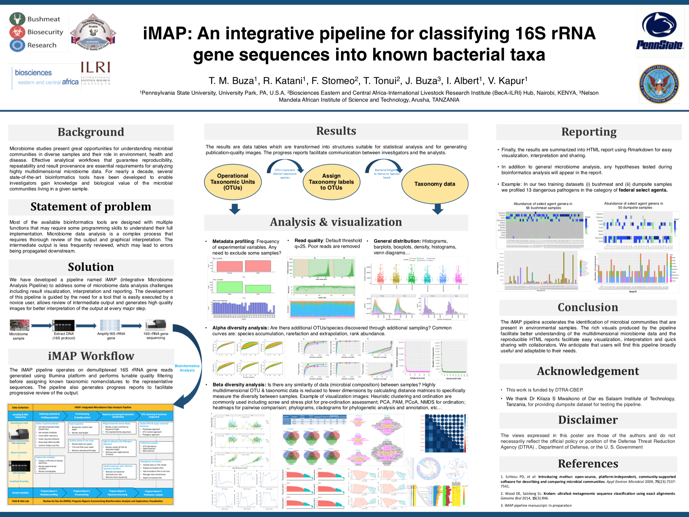

# iMAP: Integrative Microbiome Analysis Pipeline

## Analyses
1. Profiling of Metadata
2. Pre-processing of reads
3. Bioinformatics analysis of 16S rRNA gene reads
    * Phylotype-based method.
    * OTU-based method.
    * Phylogeny-based method.
4. Exploratory visualization. 

<br>

## Audience
* Microbiologists
* Bioinformaticians
* Any interested user

<br>

## Guidelines (This README)

<hr>

## Requirements

The first step is to gather all materials needed for implementing the iMAP pipeline smoothly (Table 1). 

<br>

**Table 1: List of required materials for running iMAP pipeline**

| **Requirement**    | **Description**   |  **Folder or PATH** | **Remarks**          |
| :--------------------   | :-------------------------------------------------------------   |  :---------------: | :------------:   |
| **Hardware**      | Computer with multi-core processor: preferably 64-bit. <br>Random Access Memory (RAM): 8 GB minimum. <br> Operating Systems: Linux/UNIX <br>Storage: Tens of gigabytes for small dataset otherwise a few terabytes   |    |                |
| **iMAP pipeline**       | Bundled scripts for microbiome data analysis            |  iMAP |[Link](https://github.com/tmbuza/iMAP.git)   |
| **Raw data**      | Demultiplexed reads in FASTQ format with primers and barcodes removed        |  data/references   |               |
| **Sample metadata**      | A tab-separated file showing sample identifiers, categorical, numeric variables, description...        |  data/metadata        |          |
| **Mapping file**      | A file that links sample IDs (1st column) to the names of forward (2nd column) and reverse (3rd column) data files   |  data/references   |                    |
| **Design files**      | Files that link samples with variables   |  data/references   |                    |
| **Software**      |    |      ||
| *seqkit*       | For inspecting rawdata format and simple statistics.    |  code & ~/bin | [Link](https://github.com/shenwei356/seqkit/releases/)  |
| *FastQC*      | For creating base call quality score images and statistics. Requires the latest Java Development Kit ([JDK](https://www.oracle.com/technetwork/java/javase/downloads/jdk11-downloads-5066655.html)).    |  code & ~/bin | [Link](https://www.bioinformatics.babraham.ac.uk/projects/fastqc/)  |
| *bbmap*      | Package containing tools for trimming poor quality reads    |  code  | [Link](https://sourceforge.net/projects/bbmap/files/)  |
| *bbduk.sh*      | A script for trimming poor quality reads. Available within bbmap package   |  code & ~/bin  | [Link](https://sourceforge.net/projects/bbmap/files/)  |
| *multiqc*      | For summarizing FASTQc output    | $PATH |[Link](https://github.com/ewels/MultiQC.git)  |
| *Mothur*      | For sequence processing, taxonomy assignment and preliminary analysis    |  code & ~/bin | [Link](https://github.com/Mothur/Mothur/releases/ ) |
| **Statistical analysis and visualization**     | |  |  |
| *R*      | For statistical analysis and visualization    | $PATH  | [Link](https://cran.r-project.org/)  |
| *Rstudio*      | An IDE (integrated development environment) for R    |  |[Link](https://www.rstudio.com/products/rstudio/download/)  |
| *iTOL*      | For displaying, annotating and managing phylogenetic trees   | |   [Link](http://itol.embl.de/)  |
| **Reference 16S rRNA gene alignments**   |  |  |      |
| *SILVA* (nr)   | Reference rRNA alignments    |   data/references  | [Link](https://www.mothur.org/w/images/3/32/)  |
| *SILVA* (seed)   | Reference rRNA alignments    |   data/references  | [Link](https://www.mothur.org/w/images/7/71/)  |
| **Reference 16S rRNA gene classifiers**   |    |      ||
| *SILVA*(no gap)     | Degapped using *degap.seqs* function in *Mothur*  |   data/references   ||
| *RDP*      | Mothur-formatted  |   data/references   |[Link](https://www.Mothur.org/wiki/RDP_reference_files ) |
| *Greengenes*     | Mothur-formatted  |   data/references   |[Link](https://www.Mothur.org/wiki/Greengenes-formatted_databases) |
| *EzBioCloud*     | Mothur-formatted  |   data/references   |[Link](https://www.ezbiocloud.net/resources)  ||
| *Custom classifiesr*     | Any manually built classifiers. Highly recommended when studying a specific group of known microbes.  | data/references ||
|||||

              
<br>

## Download iMAP repository
```{}
git clone https://github.com/tmbuza/iMAP.git


# OR

curl -LOk https://github.com/tmbuza/iMAP/archive/master.zip
unzip master.zip
mv iMAP-master iMAP
rm -rf master.zip


# OR


wget --no-check-certificate https://github.com/tmbuza/iMAP/archive/master.zip 
unzip master.zip
mv iMAP-master iMAP
rm -rf master.zip

```

<br>

## Metadata profiling

```{}

containerName=metadataProfilingReport
docker run --rm --name=$containerName -it -v $(pwd)/iMAP:/imap --workdir=/imap  tmbuza/rpackages:v3.5.2 /bin/bash

bash /imap/code/imap_metadata_profiling_driver.bash

exit

```

<br>

## Read Preprocessing
```{}

containerName=preprocessing
docker run --rm --name=$containerName -it -v $(pwd)/iMAP:/imap tmbuza/readqctools:v1.0.0 /bin/bash

bash code/imap_preprocess_driver.bash

exit

```
<br>


### Preprocessing progress report

```{}

containerName=readPreprocessReport
docker run --rm --name=$containerName -it -v $(pwd)/iMAP:/imap --workdir=/imap  tmbuza/rpackages:v3.5.2 /bin/bash

bash /imap/code/progressreport2.bash

```


### Sequence Processing
```{}

containerName=seqclassify
docker run --rm --name=$containerName -it -v $(pwd)/iMAP:/imap --workdir=/imap tmbuza/mothur:v1.41.3 /bin/bash

bash code/imap_classify_driver.bash

```
<br>


### Sequence processing progress report

```{}

containerName=seqProcessingReport
docker run --rm --name=$containerName -it -v $(pwd)/iMAP:/imap --workdir=/imap  tmbuza/rpackages:v3.5.2 /bin/bash

bash /imap/code/progressreport3.bash

```
<br>


## OTU data analysis and visualization 
```{}
containerName=OTUanalysis
docker run --rm --name=$containerName -it -v $(pwd)/iMAP:/imap --workdir=/imap tmbuza/mothur:v1.41.3 /bin/bash

bash code/imap_OTUanalysis_driver.bash
```

<br>


### OTU analysis progress report

```{}

containerName=OTUanalysisReport
docker run --rm --name=$containerName -it -v $(pwd)/iMAP:/imap --workdir=/imap  tmbuza/rpackages:v3.5.2 /bin/bash

bash /imap/code/progressreport4.bash

```

<br><hr>

## iMAP Poster: 2017 ASM Conference
Presented at the: <br><i><strong>2nd American Society For Microbiology (ASM) Conference on Rapid Applied Microbial Next-Generation Sequencing and Bioinformatic Pipelines</strong></i><br> 
Oct 08 - 11, 2017 | Washington, DC | USA


