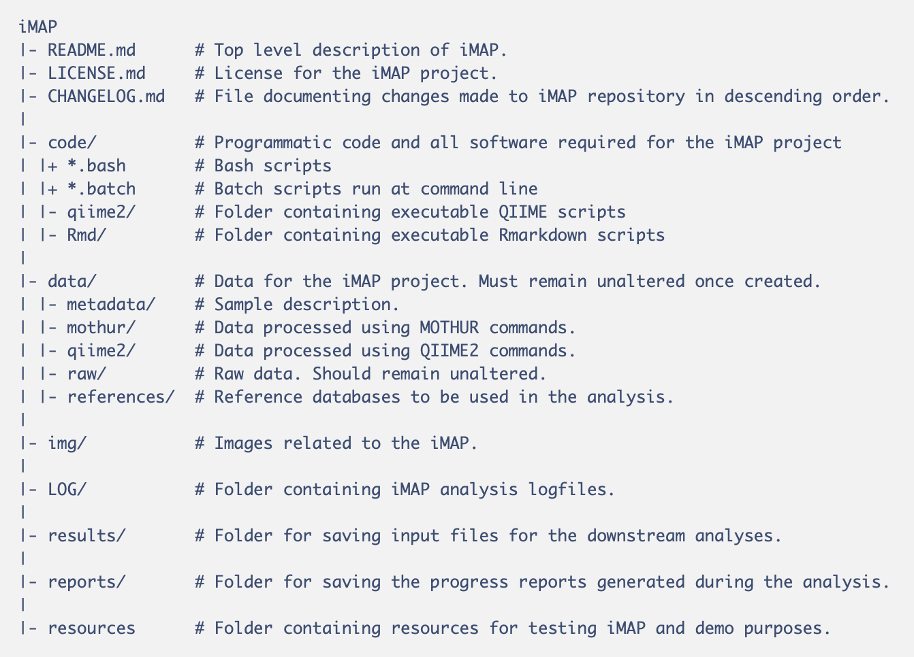

# iMAP: Integrated Microbiome Analysis Pipeline

>The financial support for developing the iMAP repository ended in October 2018. The maintainer volunteers to be contributing to this repo as a support to the microbiome research community. The primary focus is to make it highly reproducible and more user-friendly. Thank you for your patience. 

<!--Future plans: Making Rmd/Shiny apps for guiding users to create elegant images.-->
<br>

<!-- [GH-Page](https://tmbuza.github.io/iMAP/) -->

## Version: iMAP v1.0 (Pre-Release)
The iMAP v1.0 is at the preliminary phase. It currently lacks significant aspects of reproducibility compared to the existing modern bioinformatics workflow management systems. Our future plan is to integrate iMAP with a code that defines rules to enable it to be deployed across multiple platforms without any major modifications.

## Citation
Teresia M. Buza, Triza Tonui, Francesca Stomeo, Christian Tiambo, Robab Katani, Megan Schilling, Beatus Lyimo, Paul Gwakisa, Isabella M. Cattadori, Joram Buza and Vivek Kapur. iMAP: an integrated bioinformatics and visualization pipeline for microbiome data analysis. BMC Bioinformatics (2019) 20:374. [Link](https://rdcu.be/bIxrg).

<br>

## Supported Analyses
1. Profiling of sample metadata
2. Pre-processing and quality control of paired-reads
3. Sequence processing and classification
* mothur (default)
   * Phylotype-based method (works for any dataset size).
   * OTU-based method (works best for small dataset).
   * Phylogeny-based method (works best for small dataset).
* QIIME2
4. Transformation of OTU and taxa results into data structure. 
5. Diversity and statistical analysis, and visualization.
6. Phylogenetic analysis and interactive tree annotation 
7. Generating web-based progress reports
8. and more...


<br>

## Primary iMAP file folders



<br>

## Requirements

The first step is to gather all the materials needed for implementing the iMAP pipeline as described in Table 1. Most iMAP dependencies are executable and are already placed in the PATH using docker, so users should be able to launch them directly from the command line of the specified container. 


<br>
<hr>

### Non-Docker Image Users

> Read [README2.md](https://github.com/tmbuza/iMAP/blob/master/README2.md): README2 guides the implementation of iMAP directly on a specific platform, including Unix-Linux, Mac OS X, and Windows 10. Please note that this is work-in-progress.

<hr>
<br>


**Table 1: List of required materials for running iMAP pipeline**

| **Requirement**    | **Description**   |  **Location** | **Remarks**          |
| :--------------------------   | :-----------------------------------------------------  |  :---------------: | :--------------:   |
| **Raw data**      | Demultiplexed reads in FASTQ format (.gz) with primers and barcodes removed        |  data/raw   |    fastq.gz   |
| **Sample metadata**      | File name: samplemetadata.tsv. A tab-separated file linking sample identifiers to the variables    |  data/metadata    |   Format: mothur or QIIME2    |
| **Mapping files**      | For linking sample IDs to the data files   |  data/metadata   |  Mothur-formatted & QIIME2-formatted    |
| <tr><td align="left" colspan="4"><strong>Software</strong> (Mostly available via pre-built docker images)</td></tr> |
| *Docker*       | For creating Docker containers that wrap up iMAP dependencies.    | Docker Community Edition (CE) | [Link](https://docs.docker.com/v17.12/install)  |
| *Seqkit*       | For inspecting rawdata format and simple statistics.    |  docker images: readqctools  | [Link](https://hub.docker.com/r/tmbuza/readqctools)    |  docker images: readqctools | [Link](https://cloud.docker.com/u/tmbuza/repository/list)  |
| *BBduk.sh via BBMap*   | For trimming poor quality reads and removing phiX contamination    |  Auto-loaded at preprocessing step  | [Link](https://sourceforge.net/projects/bbmap/files/)  |
| *MultiQC*      | For summarizing FASTQc output    | docker images: readqctools | [Link](https://hub.docker.com/r/tmbuza/readqctools)  |
| *Mothur*      | For sequence processing, taxonomy assignment and preliminary analysis    |  docker images: mothur:v1.41.3 | [Link](https://cloud.docker.com/repository/docker/tmbuza/mothur ) |
| *QIIME2*      | For sequence processing, taxonomy assignment and preliminary analysis    |  docker images: qiime2core:v2019.1 | [Link]( https://hub.docker.com/r/tmbuza/qiime2core:v2019.1) |
| *R*      | For statistical analysis and visualization    | docker image:rpackages:v3.5.2  | [Link](https://cloud.docker.com/repository/docker/tmbuza/rpackages)  |
| *iTOL*      | For displaying, annotating and managing phylogenetic trees   | Onlline |   [Link](http://itol.embl.de/)  | 
| <tr><td align="left" colspan="4"><strong>Reference databases:</strong> Any of the following databases can be used.</td></tr> |
| *SILVA NR* (mothur)   | Mothur-formatted rRNA alignments    |   data/references  | [Link](https://www.mothur.org/w/images/3/32/)  |
| *SILVA NR* (QIIME2)    | QIIME2-formatted classifiers |   data/qiime2   | [Link](https://data.qiime2.org/2018.11/common/silva-132-99-nb-classifier.qza) 
| *SILVA* (seed)   | Mothur-formatted rRNA alignments    |   data/references  | [Link](https://www.mothur.org/w/images/7/71/)  |
| *SILVA*(de-gapped)     | mothur-formatted classifiers |   data/references   | Auto-Generated|
| *RDP*      | Mothur-formatted classifiers |   data/references   | [Link](https://www.Mothur.org/wiki/RDP_reference_files ) |
| *Greengenes*     | Mothur-formatted classifiers |   data/references   | [Link](https://www.Mothur.org/wiki/Greengenes-formatted_databases) |
| *Greengenes*     | QIIME2-formatted classifiers |   data/qiime2   | [Link](https://data.qiime2.org/2018.11/common/gg-13-8-99-nb-classifier.qza) |
| *EzBioCloud*     | Mothur-formatted classifiers |   data/references   | [Link](https://www.ezbiocloud.net/resources)  ||
| *Custom classifiesr*     | Any manually built classifiers. Highly recommended when studying a specific group of known microbes.  | data/references |Manually-built|

<br>

## Getting Started

### Running a shell command as root or system administrator
 It is likely that some systems, including Ubuntu, Linux, ... may require users to have administrative right, and in such cases:
 
* Put `sudo` in front of the command, and enter your password when prompted.
* Note that the system is often configured to not ask again for a few minutes allowing you to run several commands in succession.

<br>

### Download iMAP repository
```{}
git clone https://github.com/tmbuza/iMAP.git

# OR

curl -LOk https://github.com/tmbuza/iMAP/archive/master.zip
unzip master.zip
mv iMAP-master iMAP
rm -rf master.zip

# OR

wget --no-check-certificate https://github.com/tmbuza/iMAP/archive/master.zip 
unzip master.zip
mv iMAP-master iMAP
rm -rf master.zip

```

<br>

### Add data to designated folders
#### File formats

1. Metadata: 

    * [Samplemetadata.tsv](https://github.com/tmbuza/iMAP/blob/master/resources/metadata/samplemetadata.tsv)

2. Mapping files:

    * Mothur-format:
 [qced.files](https://github.com/tmbuza/iMAP/blob/master/resources/qced.files)
 
    * QIIME2-format:
 [manifest.txt](https://github.com/tmbuza/iMAP/blob/master/resources/manifest.txt)
 
3. Variable files (Mothur-based preliminary analysis).

    * Variable 1: 
 [var1.design](https://github.com/tmbuza/iMAP/blob/master/resources/metadata/var1.design)
 
    * Variable 2: 
 [var2.design](https://github.com/tmbuza/iMAP/blob/master/resources/metadata/var2.design)

<br>

## Data for optional testing of iMAP
The following command copy the required data files located in the iMAP/resources/ and place them in their respective folders, as shown on Table 1 above.
```{}
bash iMAP/code/demo_data.bash
```

<br>

## User Options
Users who want to change the default settings may do so using any text editor. The table below shows the location of default parameters that may be altered. 

<table>
<thead>
<tr>
<th align="left"><strong>Parameter to change</strong></th>
<th align="left"><strong>File Path</strong></th>
<th align="left"><strong>Filename</strong></th>
<th><strong>Default</strong></th>
</tr>
</thead>
<tbody>

<tr>
<td align="left">Phred score</td><td align="left">iMAP/code/preprocessing</td><td align="left">04_get_highscore_reads.bash</td><td>trimq=25</td>
</tr>

<tr>
<td align="left">Min Contig length</td><td align="left">iMAP/code/seqprocessing</td><td align="left">01_assemble_paired_reads.batch</td><td>minlength=100</td>
</tr>
<tr>
<td align="left">Max Contig length</td><td align="left">iMAP/code/seqprocessing</td><td align="left">01_assemble_paired_reads.batch</td><td>maxlength=300</td>
</tr>
<tr>
<td align="left">Min alignment length</td><td align="left">iMAP/code/seqprocessing</td><td align="left">02_align_for_16S_consensus.batch</td><td>minlength=100</td>
</tr>
<tr>
<td align="left">Max alignment length</td><td align="left">iMAP/code/seqprocessing</td><td align="left">02_align_for_16S_consensus.batch</td><td>maxlength=300</td>
</tr>
<tr>
<td align="left">Reference</td><td align="left">iMAP/code/seqclassification</td><td align="left">01_classify_seqs.batch</td><td>silva.seed.ng.fasta</td>
</tr>
<tr>
<td align="left">Taxonomy</td><td align="left">iMAP/code/seqclassification</td><td align="left">01_classify_seqs.batch</td><td>silva.seed.tax</td>
</tr>
</tr>
<tr>
<td align="left">Classification cutoff</td><td align="left">iMAP/code/seqclassification</td><td align="left">01_classify_seqs.batch</td><td>cutoff=80</td>
<tr>
<td align="left">QIIME2 settings</td><td align="left">iMAP/code/qiime2</td><td align="left">qiime2.bash</td><td>DADA2 QC parameters are set at 0</td>
</tr>
</tr>
</tbody>
</table>


<br>


## Set up Docker
Link: https://docs.docker.com/install/
Register for a Docker ID. Link: https://docs.docker.com/docker-id/

### Download dependencies images
Includes:
1. [rpackages:v3.5.2](https://hub.docker.com/r/tmbuza/rpackages) for R version 3.5.2 and several packages.
2. [readqctools:v1.0.0](https://hub.docker.com/r/tmbuza/readqctools) for quality control of the reads.
3. [mothur:v1.41.3](https://hub.docker.com/r/tmbuza/mothur) for sequence classification and for generating mothur-based OTU tables.
4. [qiime2core:v2019.1](https://hub.docker.com/r/tmbuza/qiime2core) for sequence classification and for generating qiime2-based OTU table.

Run the following to install the images. Alternatively, to install individual image use `docker pull tmbuza/imagename`.

```{}
# All images at once

bash iMAP/code/dockerImages.sh

# Individual image

docker pull tmbuza/imagename

```

### Confirm the installation
```{}
docker images
```

## Start the analysis

<br>

### Metadata profiling
```{}
containerName=report1
docker run --rm --name=$containerName -it -v $(pwd)/iMAP:/imap --workdir=/imap  tmbuza/rpackages:v3.5.2 /bin/bash

bash code/01_metadataProfiling_driver.bash
exit
```

<br>

### Read Preprocessing
```{}
containerName=readpreprocess
docker run --rm --name=$containerName -it -v $(pwd)/iMAP:/imap tmbuza/readqctools:v1.0.0 /bin/bash

bash code/02_readPreprocess_driver.bash

exit
```
> The HTML files summarizing the Read FastQC reports are stored in the **results/multiqc/ folder**. Open the files in your favorite browser or try to open it using CLI like:

```{}
open results/multiqc/qced/R1/multiqc_report.html
```

<br>

### Preprocessing progress report
```{}
containerName=report2
docker run --rm --name=$containerName -it -v $(pwd)/iMAP:/imap --workdir=/imap  tmbuza/rpackages:v3.5.2 /bin/bash

bash code/progressreport2.bash
exit
```

<br>

# MOTHUR: Sequence Processing and classification

1. Create a mothur container for sequence processing and classification.

```{}
containerName=mothurseqprocessing
docker run --rm --name=$containerName -it -v $(pwd)/iMAP:/imap --workdir=/imap tmbuza/mothur:v1.41.3 /bin/bash
```

2. Run the sequence processing and classification command which implements the folllowing:
    * Download reference alignments
      * Default: [SILVA seed](https://www.mothur.org/w/images/7/71/)    
    * Assemble the forward and reverse reads, screen by length and create representative sequences
    * Align representative sequences with reference alignments. Default [SILVA seed](https://www.mothur.org/w/images/7/71/).
    * Denoise to remove poor alignments
    * Remove Chimeric sequences.
    * Classify the sequences and do post-classification QC.
    * Estimates the sequencing error rate.

```{}
bash ./code/03_imapClassifySEQ_driver.bash 
```
> You may see a lot of WARNINGS, It is safe to ignore them.

> The program is set to remove all temporary files after completeing processing the sequences. If no file found you may see an error message that reads: *rm: cannot remove '*.temp': No such file or directory*
<br>

### OTU clustering, Taxonomy assignement and preliminary analysis (Mothur)
1. Phylotype-based method  (works for any dataset size).
    
```{}
bash ./code/04_1_phylotype_driver.bash
```
<br>

2. OTU-cluster method (works best for small dataset).
    
```{}
bash ./code/04_2_otucluster_driver.bash
```

<br>

3. Phylogeny-based method (works best for small dataset).
    
```{}
bash ./code/04_3_phylogeny_driver.bash
```

<br>

### Sequence processing progress report
```{}
containerName=report3
docker run --rm --name=$containerName -it -v $(pwd)/iMAP:/imap --workdir=/imap  tmbuza/rpackages:v3.5.2 /bin/bash

bash code/progressreport3.bash
exit
```

<br>

### Data Transformation
```{}
containerName=datatransformation
docker run --rm --name=$containerName -it -v $(pwd)/iMAP:/imap --workdir=/imap  tmbuza/rpackages:v3.5.2 /bin/bash

bash code/datatransformation.bash
exit
```

<br>


### OTU analysis progress report
```{}
containerName=report4
docker run --rm --name=$containerName -it -v $(pwd)/iMAP:/imap --workdir=/imap  tmbuza/rpackages:v3.5.2 /bin/bash

bash code/progressreport4.bash
exit
```
<br><hr><br>

### Statistical analysis
> Statistical analysis compares the variables, and variables are very specific and unique in different studies. Below are links to most important statistical analyses in microbiome studies:

* [AMOVA](https://mothur.org/wiki/Amova)
* [HOMOVA](https://mothur.org/wiki/Homova)
* [ANOSIM](https://mothur.org/wiki/Anosim)
* [Kruska-Walis](https://mothur.org/wiki/Kruskal.wallis)
* [Lefse](https://mothur.org/wiki/Lefse)
* [Metastats](https://mothur.org/wiki/Metastats)
* [More...](https://mothur.org/wiki/Category:Commands)


<hr><hr><br>

# QIIME2: Sequence Processing and Classification
* Requires a QIIME2 trained classifer. 
* You can train your own classifier using the [q2-feature-classifier](https://github.com/qiime2/q2-feature-classifier).
* Classifier: Naive Bayes classifiers trained on GreenGenes or SILVA database with 99% OTUs. 

* Download pretrained classifiers for QIIME2 sequence classification:
	* The 515-806 conservative fragments
		* iMAP default due to its small size.
		* Can be spanned by sequencing 200–300 nt from both ends using Illumina MiSeq.
	*  Alternative pretrained classifiers are available including, full length greengenes and SILVA (see links on Table 1).
	
<br>

## Get reference classifier

**Download 515-806 conservative fragments**

```{}
# bash iMAP/code/qiime2/qiime2_gg_classifier_fragments.bash
bash iMAP/code/qiime2/qiime2-99-515-806-nb-classifier.bash
```
	
<br>

>If using other pretrained QIIME2-formatted classifiers you must replace the default settings in the executable file. Below is a location and the file to be altered. Find and replace "gg-13-8-99-515-806-nb-classifier.qza" string with the name of your favorable classifier.

<table>
<thead>
<tr>
<th align="left"><strong>Parameter to change</strong></th>
<th align="left"><strong>Filename</strong></th>
<th><strong>Default</strong></th>
</tr>
</thead>
<tbody>

<tr>
<td align="left">Classifier</td><td align="left">iMAP/code/qiime2/qiime2.bash</td><td>gg-13-8-99-515-806-nb-classifier.qza</td>
</tr>

</tr>
</tbody>
</table>


<br>

### Create QIIME2 container
```{}
containerName=qiime2classification
docker run --rm --name=$containerName -it -v $(pwd)/iMAP:/imap --workdir=/imap  tmbuza/qiime2core:v2019.1 /bin/bash
```

### Start the analysis
```{}
bash code/qiime2/qiime2.bash
echo "Completed QIIME2 pipeline"
```
<br><hr>

### View QIIME 2 results
Output path: iMAP/data/qiime2/results/

Use client-side interface: [https://view.qiime2.org/](https://view.qiime2.org/) to view the results.

Simply drag and drop the QIIME 2 artifacts (.qza files) or the visualizations (.qzv files). 

For more help visit [https://view.qiime2.org/about](https://view.qiime2.org/about).

<br><hr><br>

## Useful commands

### 1. Convert mothur biom file within QIIME2

The output is a file containing OTUs and taxonomy
```{}
containerName=biomconvertmothur
docker run --rm --name=$containerName -it -v $(pwd)/iMAP:/imap --workdir=/imap  tmbuza/qiime2core:v2019.1 /bin/bash

bash code/qiime2/convertmothur_biom.bash
exit
```
