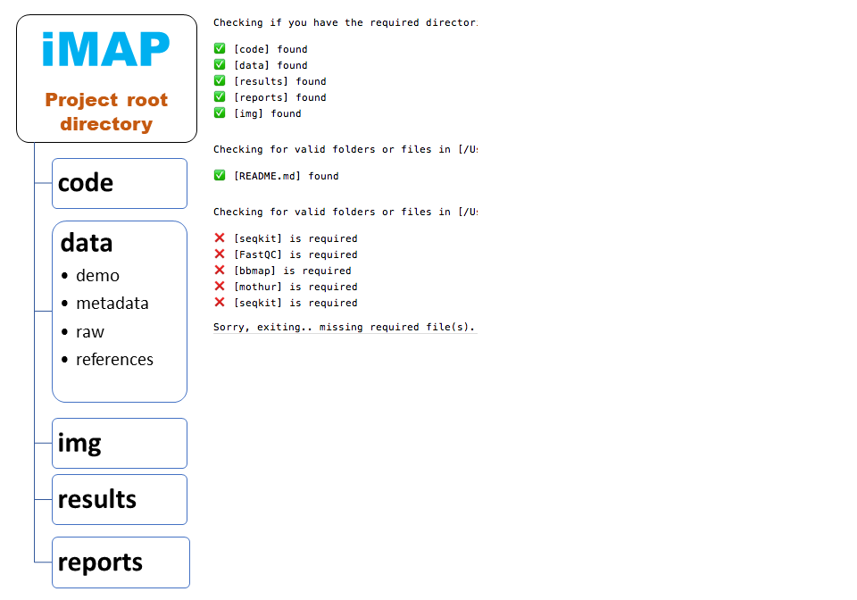

# iMAP: Integrative Microbiome Analysis Pipeline

The iMAP is a two-tier pipeline consisting of:

1. Bioinformatics analysis of 16S rRNA gene reads
2. Exploratory visualization. 

<br>

## Audience
* Microbiologists
* Ecologist
* Any interested user

<br>

# Guidelines

<hr>

## Requirements

The first step is to gather all materials needed for implementing the iMAP pipeline smoothly (Table 1). 

<br>

**Table 1: List of required materials for running iMAP pipeline**

| **Requirement**    | **Description**   |  **Folder or PATH** | **Remarks**          |
| :--------------------   | :-------------------------------------------------------------   |  :---------------: | :------------:   |
| **Hardware**      | Computer with multi-core processor: preferably 64-bit. <br>Random Access Memory (RAM): 8 GB minimum. <br> Operating Systems: Linux/UNIX <br>Storage: Tens of gigabytes for small dataset otherwise a few terabytes   |    |                |
| **iMAP pipeline**       | Bundled scripts for microbiome data analysis            |  iMAP |[Link](https://github.com/tmbuza/iMAP.git)   |
| **Raw data**      | Demultiplexed reads in FASTQ format with primers and barcodes removed        |  data/references   |               |
| **Sample metadata**      | A tab-separated file showing sample identifiers, categorical, numeric variables, description...        |  data/metadata        |          |
| **Mapping file**      | A file that links sample IDs (1st column) to the names of forward (2nd column) and reverse (3rd column) data files   |  data/references   |                    |
| **Design files**      | Files that link samples with variables   |  data/references   |                    |
| **Software**      |    |      ||
| *seqkit*       | For inspecting rawdata format and simple statistics.    |  code & ~/bin | [Link](https://github.com/shenwei356/seqkit/releases/)  |
| *FastQC*      | For creating base call quality score images and statistics. Requires the latest Java Development Kit ([JDK](https://www.oracle.com/technetwork/java/javase/downloads/jdk11-downloads-5066655.html)).    |  code & ~/bin | [Link](https://www.bioinformatics.babraham.ac.uk/projects/fastqc/)  |
| *bbmap*      | Package containing tools for trimming poor quality reads    |  code  | [Link](https://sourceforge.net/projects/bbmap/files/)  |
| *bbduk.sh*      | A script for trimming poor quality reads. Available within bbmap package   |  code & ~/bin  | [Link](https://sourceforge.net/projects/bbmap/files/)  |
| *multiqc*      | For summarizing FASTQc output    | $PATH |[Link](https://github.com/ewels/MultiQC.git)  |
| *Mothur*      | For sequence processing, taxonomy assignment and preliminary analysis    |  code & ~/bin | [Link](https://github.com/Mothur/Mothur/releases/ ) |
| **Statistical analysis and visualization**     | |  |  |
| *R*      | For statistical analysis and visualization    | $PATH  | [Link](https://cran.r-project.org/)  |
| *Rstudio*      | An IDE (integrated development environment) for R    |  |[Link](https://www.rstudio.com/products/rstudio/download/)  |
| *iTOL*      | For displaying, annotating and managing phylogenetic trees   | |   [Link](http://itol.embl.de/)  |
| **Reference 16S rRNA gene alignments**   |  |  |      |
| *SILVA* (nr)   | Reference rRNA alignments    |   data/references  | [Link](https://www.mothur.org/w/images/3/32/)  |
| *SILVA* (seed)   | Reference rRNA alignments    |   data/references  | [Link](https://www.mothur.org/w/images/7/71/)  |
| **Reference 16S rRNA gene classifiers**   |    |      ||
| *SILVA*(no gap)     | Degapped using *degap.seqs* function in *Mothur*  |   data/references   ||
| *RDP*      | Mothur-formatted  |   data/references   |[Link](https://www.Mothur.org/wiki/RDP_reference_files ) |
| *Greengenes*     | Mothur-formatted  |   data/references   |[Link](https://www.Mothur.org/wiki/Greengenes-formatted_databases) |
| *EzBioCloud*     | Mothur-formatted  |   data/references   |[Link](https://www.ezbiocloud.net/resources)  ||
| *Custom classifiesr*     | Any manually built classifiers. Highly recommended when studying a specific group of known microbes.  | data/references ||
|||||

              
<br>

## Download iMAP repository
```{}
git clone https://github.com/tmbuza/iMAP.git
cd iMAP

# OR

curl -LOk https://github.com/tmbuza/iMAP/archive/master.zip
unzip master.zip
mv iMAP-master iMAP
rm -rf master.zip
cd iMAP


# OR


wget --no-check-certificate https://github.com/tmbuza/iMAP/archive/master.zip 
unzip master.zip
mv iMAP-master iMAP
rm -rf master.zip
cd iMAP
```

<br>

## Gather required materials
* Raw data (demultiplexed compressed FASTQ files). 
* Metadata, mothur-formatted mapping files (commonly with extension .design)
* Install required software 
* Download reference databases (alignments and classifiers)

```{}
# linux
bash ./code/requirements/iMAP_requirements_linux_driver.bash

# mac OS
bash ./code/requirements/iMAP_requirements_mac_driver.bash

# windows
bash ./code/requirements/iMAP_requirements_windows_driver.bash # Incomplete
```

<br>

## Verify required folders and important files

```{}
bash ./code/requirements/iMAP_checkFiles_driver.bash

open reports/checked_files.txt

# OR

cat reports/checked_files.txt
```

<br>

### Sample output 
Middle and right panel

<br>



Figure S1: Major folders in the iMAP root directory. Folders and files marked with tick exist. Missing file marked X must be found before proceeding.

<hr>
<br>

# Progress report 1: Metadata profiling

```{}
bash ./code/progressreport1.bash # Revised on 02/06/2019
```

<br>

# Bioinformatics analysis

<br>

## CLI: Command-line-interface
This is basically a method where users sequentially run individual or bundle scripts on CLI (Command -Line_Interface) one at a time. We have bundled workflow-specific scripts into a driver to make the analysis easily implemented on CLI by just a single click.

```{}
#Read Preprocessing
bash ./code/preprocessing/iMAP_preprocessing_driver.bash
bash ./code/summarizeFastQC/iMAP_multiqc_driver.bash
bash ./code/progressreport2.bash # Revised on 02/06/2019

#Sequence Processing
bash ./code/mockcommunity/iMAP_mockcommunity_driver.bash
bash ./code/seqprocessing/iMAP_seqprocessing_driver.bash
bash ./code/seqclassification/iMAP_seqclassification_driver.bash
bash ./code/seqerrorrate/iMAP_seqerrorrate_driver.bash # Optional
bash ./code/otutaxonomy/iMAP_otutaxonomy_driver.bash
bash ./code/annotation/01_processed_seqs.bash # Summarizing processed sequences
bash ./code/annotation/02_merge_summary_files.bash # Merge summary files to evaluate read length
bash ./code/progressreport3.bash # Revised on 02/06/2019

#Output Analysis
bash ./code/dataanalysis/iMAP_dataanalysis_demo_driver.bash # Optional mothur-based preliminary analysis
bash ./code/progressreport4.bash # Currently being revised
```

<br>

## Batch mode on CLI
The *iMAP_driver.bash* is the master driver for running all analyses on CLI at once.

```{}
bash ./code/linux_iMAP_driver.bash
bash ./code/mac_iMAP_driver.bash
bash ./code/windows_iMAP_driver.bash # In progress

# Optionally you can use time tracking driver
bash ./code/linux_time_tracking_driver.bash
bash ./code/mac_time_tracking_driver.bash
bash ./code/windows_time_tracking_driver.bash # In progress

```

<br>

## Remotely via job scheduling script
Users must create a Portable Batch System (PBS) script that describes cluster resources to be used, parameters for the job and the commands to be executed. The following is a PBS script for running executing iMAP pipeline remotely. Note that you must provide the group allocation name (-A) but this may differ from system to system. Google for help just in case.

<br>

**Individual driver**
```{}
#!/bin/bash -f

#PBS iMAPtest
#PBS -A group allocation name
#PBS -l nodes=1:ppn=8
#PBS -l walltime=4000:00:00
#PBS -l pmem=20gb
#PBS -j oe
#PBS -o iMAPtest.log
#PBS -m abe
#PBS -M tmb72@psu.edu

cd $PBS_O_WORKDIR

# Comment unused command(s) as necessary and uncomment the command(s) to be executed

bash ./code/requirements/iMAP_requirements_linux_driver.bash
bash ./code/requirements/iMAP_checkFiles_driver.bash
bash ./code/preprocessing/iMAP_preprocessing_driver.bash
bash ./code/summarizeFastQC/iMAP_multiqc_driver.bash
bash ./code/mockcommunity/iMAP_mockcommunity_driver.bash
bash ./code/seqprocessing/iMAP_seqprocessing_driver.bash
bash ./code/seqclassification/iMAP_seqclassification_driver.bash
bash ./code/seqerrorrate/iMAP_seqerrorrate_driver.bash # Optional
bash ./code/otutaxonomy/iMAP_otutaxonomy_driver.bash
bash ./code/annotation/01_processed_seqs.bash
bash ./code/dataanalysis/iMAP_dataanalysis_demo_driver.bash # Optional mothur-based preliminary analyses
```

<br>

**Batch mode**
```{}
#!/bin/bash -f

#PBS iMAPtest
#PBS -A group allocation name
#PBS -l nodes=1:ppn=8
#PBS -l walltime=4000:00:00
#PBS -l pmem=20gb
#PBS -j oe
#PBS -o iMAPtest.log
#PBS -m abe
#PBS -M tmb72@psu.edu

cd $PBS_O_WORKDIR

bash code/linux_iMAP_driver.bash
```

<br>
<hr>

# iMAP Conference Poster
Presented at the: <br><i><strong>2nd American Society For Microbiology (ASM) Conference on Rapid Applied Microbial Next-Generation Sequencing and Bioinformatic Pipelines</strong></i><br> 
Oct 08 - 11, 2017 | Washington, DC | USA


