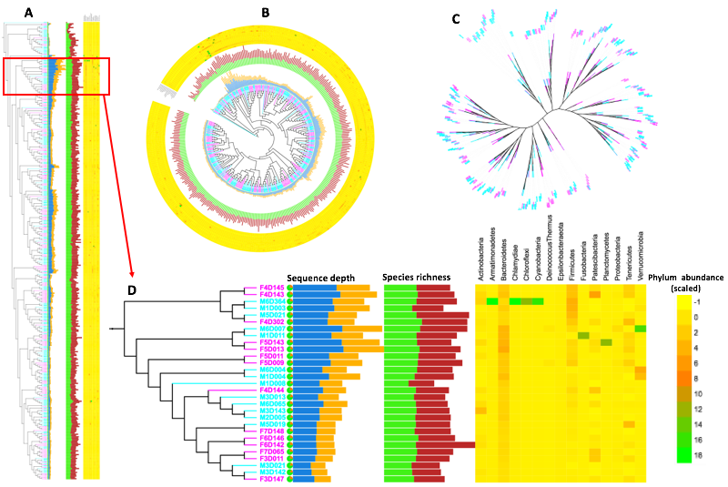

<br>

```{r setup, include=FALSE}
load("./packages.RData")
load("./globalSetup.RData")
load("./metadatavars.RData")
load("./otutaxon.RData")

knitr::opts_chunk$set(fig.path='./img/', fig.show='asis',  dev = 'png', fig.align='center', out.width = "80%",  out.height = "80%", echo=TRUE, comment = NA, warning=FALSE, message=FALSE)
# knitr::opts_chunk$set(fig.path='./images/pdf/', fig.show='asis',  dev = 'pdf', fig.align='center', out.width = "80%",  out.height = "80%", echo=TRUE, comment = NA, warning=FALSE, message=FALSE)
knitr::opts_chunk$set(echo = FALSE)
knitr::opts_chunk$set(comment = NA)
knitr::opts_chunk$set(message = FALSE)
knitr::opts_chunk$set(warning = FALSE)

```


## Conserved taxonomy assignment

### Methods:

* Phylotype method at genus level.
* OTU-based method with minimum set at 97% identity. The opticlust algorithm was used to optimize the quality of assigned taxonomy.
* Phylogeny method where tree was taxonomically classified with minimum set at 97% identity

<br>

### Quality of conserved taxonomy
The opticlust algorithm yielded high quality OTUs based on the high precision metrics below.

<br>

|	Parameter	|	Value	|
| :---	| --|	
|	cutoff	|	0.2	|
|	Sensitivity	|	0.998	|
|	Specificity	|	0.999	|
|	PPV	|	0.998	|
|	NPV	|	0.999	|
|	Accuracy	|	0.999	|
|	MCC	|	0.997	|
|	F1score	|	0.998	|
|	FDR	|	0.002	|

Table: Table x: Statistical parameters calculated from the OTU-based classification method

<!-- <br> -->


## Taxonomy assigned to observed OTUs {-}
> The taxonomy assignment is based on the phylotype method in mothur platform. Only taxon observed more than once are displayed.

```{bash}
perl ../../code/splitlefse.pl ../../data/mothur/phylotype/qced.trim.contigs.good.unique.good.filter.unique.precluster.pick.seed.wang.pick.pick.tx.1.lefse \
../../results/tables/phylotype/relabund_shared.tsv
```


```{r message=FALSE, warning=FALSE, include=FALSE}
relabund <- read.table("../../results/tables/phylotype/relabund_shared.tsv", header = TRUE, sep = "\t")

casestudynames <- c("Bacteria", "Phylum", "Class", "Order", "Family", "Genus", "OTU", "F3D001", "F3D006", "F3D142", "F3D143", "M1D001", "M1D006", "M1D142", "M1D143")

# casestudynames <- c("Bacteria",	"Phylum",	"Class", "Order",	"Family",	"Genus", "OTU",	"F3D000",	"F3D001",	"F3D011",	"F3D125",	"F3D013",	"F3D141",	"F3D142",	"F3D143",	"F3D144",	"F3D145",	"F3D146",	"F3D147",	"F3D148",	"F3D149",	"F3D015",	"F3D150",	"F3D017",	"F3D019",	"F3D002",	"F3D021",	"F3D025",	"F3D003",	"F3D364",	"F3D005",	"F3D006",	"F3D065",	"F3D007",	"F3D008",	"F3D009",	"F4D000",	"F4D001",	"F4D011",	"F4D125",	"F4D013",	"F4D141",	"F4D142",	"F4D143",	"F4D144",	"F4D145",	"F4D146",	"F4D147",	"F4D148",	"F4D149",	"F4D015",	"F4D150",	"F4D017",	"F4D019",	"F4D002",	"F4D021",	"F4D025",	"F4D003",	"F4D302",	"F4D004",	"F4D005",	"F4D006",	"F4D065",	"F4D007",	"F4D008",	"F4D009",	"F5D000",	"F5D001",	"F5D011",	"F5D125",	"F5D013",	"F5D141",	"F5D142",	"F5D143",	"F5D144",	"F5D145",	"F5D146",	"F5D147",	"F5D148",	"F5D149",	"F5D015",	"F5D150",	"F5D165",	"F5D017",	"F5D019",	"F5D002",	"F5D021",	"F5D025",	"F5D003",	"F5D364",	"F5D004",	"F5D045",	"F5D005",	"F5D006",	"F5D065",	"F5D007",	"F5D008",	"F5D009",	"F6D000",	"F6D001",	"F6D011",	"F6D125",	"F6D013",	"F6D141",	"F6D142",	"F6D143",	"F6D144",	"F6D145",	"F6D146",	"F6D147",	"F6D148",	"F6D149",	"F6D015",	"F6D150",	"F6D165",	"F6D017",	"F6D019",	"F6D002",	"F6D021",	"F6D025",	"F6D003",	"F6D364",	"F6D004",	"F6D045",	"F6D005",	"F6D006",	"F6D065",	"F6D007",	"F6D008",	"F6D009",	"F7D000",	"F7D001",	"F7D011",	"F7D124",	"F7D013",	"F7D141",	"F7D142",	"F7D143",	"F7D144",	"F7D145",	"F7D146",	"F7D147",	"F7D148",	"F7D149",	"F7D015",	"F7D150",	"F7D002",	"F7D025",	"F7D003",	"F7D004",	"F7D045",	"F7D005",	"F7D006",	"F7D065",	"F7D007",	"F7D009",	"F8D000",	"F8D001",	"F8D125",	"F8D141",	"F8D142",	"F8D143",	"F8D144",	"F8D145",	"F8D146",	"F8D147",	"F8D148",	"F8D149",	"F8D150",	"F8D002",	"F8D025",	"F8D003",	"F8D004",	"F8D045",	"F8D005",	"F8D006",	"F8D065",	"F8D007",	"F8D008",	"F8D009",	"M1D000",	"M1D001",	"M1D011",	"M1D125",	"M1D013",	"M1D141",	"M1D142",	"M1D143",	"M1D144",	"M1D145",	"M1D146",	"M1D147",	"M1D148",	"M1D149",	"M1D015",	"M1D017",	"M1D019",	"M1D002",	"M1D021",	"M1D025",	"M1D003",	"M1D364",	"M1D004",	"M1D005",	"M1D006",	"M1D065",	"M1D007",	"M1D008",	"M1D009",	"M2D000",	"M2D001",	"M2D011",	"M2D125",	"M2D013",	"M2D141",	"M2D142",	"M2D143",	"M2D144",	"M2D145",	"M2D146",	"M2D147",	"M2D148",	"M2D149",	"M2D015",	"M2D150",	"M2D017",	"M2D019",	"M2D002",	"M2D021",	"M2D025",	"M2D003",	"M2D364",	"M2D004",	"M2D005",	"M2D006",	"M2D065",	"M2D007",	"M2D008",	"M2D009",	"M3D000",	"M3D001",	"M3D011",	"M3D125",	"M3D013",	"M3D141",	"M3D142",	"M3D143",	"M3D144",	"M3D145",	"M3D146",	"M3D147",	"M3D148",	"M3D149",	"M3D015",	"M3D150",	"M3D017",	"M3D175",	"M3D019",	"M3D002",	"M3D021",	"M3D025",	"M3D003",	"M3D364",	"M3D004",	"M3D045",	"M3D005",	"M3D006",	"M3D065",	"M3D007",	"M3D008",	"M3D009",	"M4D000",	"M4D001",	"M4D011",	"M4D125",	"M4D013",	"M4D141",	"M4D142",	"M4D143",	"M4D144",	"M4D145",	"M4D146",	"M4D147",	"M4D148",	"M4D149",	"M4D015",	"M4D150",	"M4D017",	"M4D175",	"M4D019",	"M4D002",	"M4D021",	"M4D025",	"M4D003",	"M4D364",	"M4D004",	"M4D045",	"M4D005",	"M4D006",	"M4D065",	"M4D007",	"M4D008",	"M4D009",	"M5D000",	"M5D001",	"M5D011",	"M5D124",	"M5D013",	"M5D141",	"M5D142",	"M5D143",	"M5D144",	"M5D145",	"M5D146",	"M5D147",	"M5D148",	"M5D149",	"M5D015",	"M5D150",	"M5D017",	"M5D175",	"M5D019",	"M5D002",	"M5D021",	"M5D025",	"M5D003",	"M5D364",	"M5D004",	"M5D045",	"M5D005",	"M5D006",	"M5D065",	"M5D007",	"M5D008",	"M5D009",	"M6D000",	"M6D001",	"M6D011",	"M6D124",	"M6D013",	"M6D141",	"M6D142",	"M6D143",	"M6D144",	"M6D145",	"M6D146",	"M6D147",	"M6D148",	"M6D149",	"M6D015",	"M6D150",	"M6D017",	"M6D175",	"M6D019",	"M6D002",	"M6D021",	"M6D025",	"M6D003",	"M6D364",	"M6D004",	"M6D045",	"M6D005",	"M6D006",	"M6D065",	"M6D007",	"M6D008",	"M6D009")

names(relabund) <- casestudynames

# Define variables for relabund object
relabund$Bacteria <- as.factor(relabund$Bacteria)
relabund$Phylum <- as.factor(relabund$Phylum)
relabund$Class <- as.factor(relabund$Class)
relabund$Order <- as.factor(relabund$Order)
relabund$Family <- as.factor(relabund$Family)
relabund$Genus <- as.factor(relabund$Genus)
relabund$OTU <- as.factor(relabund$OTU)

# Get frequencies
library(funModeling)

bactfreq <- freq(relabund$Bacteria)
phyfreq <- freq(relabund$Phylum)
clafreq <- freq(relabund$Class)
ordfreq <- freq(relabund$Order)
famfreq <- freq(relabund$Family)
genfreq <- freq(relabund$Genus)
otufreq <- freq(relabund$OTU)

# Long format
library(reshape2)

relabund.m <- melt(relabund)

# Define variables for relabund.m object
relabund.m$Bacteria <- as.factor(relabund.m$Bacteria)
relabund.m$Phylum <- as.factor(relabund.m$Phylum)
relabund.m$Class <- as.factor(relabund.m$Class)
relabund.m$Order <- as.factor(relabund.m$Order)
relabund.m$Family <- as.factor(relabund.m$Family)
relabund.m$Genus <- as.factor(relabund.m$Genus)
relabund.m$OTU <- as.factor(relabund.m$OTU)
relabund.m$variable <- as.factor(relabund.m$variable)
relabund.m$value <- as.factor(relabund.m$value)

# Subsetting long data

library(dplyr)
relbactdata.m <- relabund.m %>% as.data.frame() %>% dplyr::select(Bacteria, variable, value)
relphydata.m <- relabund.m %>% as.data.frame() %>% dplyr::select(Phylum, variable, value)
relcladata.m <- relabund.m %>% as.data.frame() %>% dplyr::select(Class, variable, value)
relorddata.m <- relabund.m %>% as.data.frame() %>% dplyr::select(Order, variable, value)
relfamdata.m <- relabund.m %>% as.data.frame() %>% dplyr::select(Family, variable, value)
relgendata.m <- relabund.m %>% as.data.frame() %>% dplyr::select(Genus, variable, value)

save.image(file = "caseStudyOTUs.RData")
```


```{r fig.height=12, fig.width=12, message=FALSE, warning=FALSE}
library(ggplot2)
library(ggpubr)
library(scales)

phyplot <- phyfreq %>% as.data.frame() %>% dplyr::filter(frequency >1& !grepl("*unclassified*|*Uncultured*|*uncultured*", var)) %>% 
  ggplot(aes(y = frequency, x = reorder(var, -frequency))) +
  theme_classic() +
  geom_bar(stat = "identity", position = "dodge", fill = "#047330") +
  theme(legend.position="none") +
  theme(axis.text.x = element_text(angle = 0, hjust = 1, size = 12))+
  theme(axis.text.y = element_text(angle = 0, hjust = 1, size = 12))+
  scale_y_continuous(labels = comma, breaks=pretty_breaks(n=8)) +
  labs(x = "", y = " Number of OTUs", title = "Phylum") + 
  coord_flip() +
  formatPlot2

claplot <- clafreq %>% as.data.frame() %>% dplyr::filter(frequency >1& !grepl("*unclassified*|*Uncultured*|*uncultured*", var)) %>% 
  ggplot(aes(y = frequency, x = reorder(var, -frequency))) +
  theme_classic() +
  geom_bar(stat = "identity", position = "dodge", fill = "blue4") +
  theme(legend.position="none") +
  theme(axis.text.x = element_text(angle = 0, hjust = 1, size = 12))+
  theme(axis.text.y = element_text(angle = 0, hjust = 1, size = 12))+
  scale_y_continuous(labels = comma, breaks=pretty_breaks(n=8)) +
  labs(x = "", y = " Number of OTUs", title = "Class") + 
  coord_flip() +
  formatPlot2

ordplot <- ordfreq %>% as.data.frame() %>% dplyr::filter(frequency >1& !grepl("*unclassified*|*Uncultured*|*uncultured*", var)) %>% 
  ggplot(aes(y = frequency, x = reorder(var, -frequency))) +
  theme_classic() +
  geom_bar(stat = "identity", position = "dodge", fill = "magenta3") +
  theme(legend.position="none") +
  theme(axis.text.x = element_text(angle = 0, hjust = 1, size = 12))+
  theme(axis.text.y = element_text(angle = 0, hjust = 1, size = 12))+
  scale_y_continuous(labels = comma, breaks=pretty_breaks(n=8)) +
  labs(x = "", y = " Number of OTUs", title = "Order") + 
  coord_flip() +
  formatPlot2


famplot <- famfreq %>% as.data.frame() %>% dplyr::filter(frequency >1 & !grepl("*unclassified*|*Uncultured*|*uncultured*", var)) %>% 
  ggplot(aes(y = frequency, x = reorder(var, -frequency))) +
  theme_classic() +
  geom_bar(stat = "identity", position = "dodge", fill = "orange3") +
  theme(legend.position="none") +
  theme(axis.text.x = element_text(angle = 0, hjust = 1, size = 12))+
  theme(axis.text.y = element_text(angle = 0, hjust = 1, size = 12))+
  scale_y_continuous(labels = comma, breaks=pretty_breaks(n=8)) +
  labs(x = "", y = " Number of OTUs", title = "Family") + 
  coord_flip() +
  formatPlot2

ggarrange(phyplot, claplot, ordplot, famplot, ncol = 2, nrow = 2)

```


```{r taxoncloud, eval=FALSE, message=FALSE, warning=FALSE, include=FALSE}
set.seed(110912)
library(tm)

# taxon4wordcloud <- readr::read_table2(file = "../../results/tables/wordcloud/merged.tsv")
taxon4wordcloud <- readr::read_table2(file = "../../results/tables/wordcloud/taxmerged4wordcloud.txt")

phylumwords <- taxon4wordcloud$Phylum
write.table(phylumwords,"../../results/tables/wordcloud/phylumwords.tsv",sep="\t", row.names = FALSE, col.names = FALSE)

# Load the data as a corpus
docs <- Corpus(VectorSource(phylumwords))

# inspect(docs)

toSpace <- content_transformer(function (x , pattern ) gsub(pattern, " ", x))
docs <- tm_map(docs, toSpace, "/")
docs <- tm_map(docs, toSpace, "@")
docs <- tm_map(docs, toSpace, "\\|")

# Convert the text to lower case
docs <- tm_map(docs, content_transformer(tolower))
docs <- tm_map(docs, removeWords, stopwords("english"))
# Remove punctuations
docs <- tm_map(docs, removePunctuation)
# Eliminate extra white spaces
docs <- tm_map(docs, stripWhitespace)
# Text stemming
# docs <- tm_map(docs, stemDocument)
	tdm <- TermDocumentMatrix(docs)
	m <- as.matrix(tdm)
	v <- sort(rowSums(m),decreasing=TRUE)
	p_worddf <- data.frame(word = names(v),freq=v)
	p_worddf[2] <- log2(p_worddf[2])

#####################

classwords <- taxon4wordcloud$Class
write.table(classwords,"../../results/tables/wordcloud/classwords.tsv",sep="\t", row.names = FALSE, col.names = FALSE)
# Load the data as a corpus
docs <- Corpus(VectorSource(classwords))

# inspect(docs)

toSpace <- content_transformer(function (x , pattern ) gsub(pattern, " ", x))
docs <- tm_map(docs, toSpace, "/")
docs <- tm_map(docs, toSpace, "@")
docs <- tm_map(docs, toSpace, "\\|")

# Convert the text to lower case
docs <- tm_map(docs, content_transformer(tolower))
docs <- tm_map(docs, removeWords, stopwords("english"))
# Remove punctuations
docs <- tm_map(docs, removePunctuation)
# Eliminate extra white spaces
docs <- tm_map(docs, stripWhitespace)
# Text stemming
# docs <- tm_map(docs, stemDocument)
	tdm <- TermDocumentMatrix(docs)
	m <- as.matrix(tdm)
	v <- sort(rowSums(m),decreasing=TRUE)
	c_worddf <- data.frame(word = names(v),freq=v)
	c_worddf[2] <- log2(c_worddf[2])

#####################

orderwords <- taxon4wordcloud$Order
write.table(orderwords,"../../results/tables/wordcloud/orderwords.tsv",sep="\t", row.names = FALSE, col.names = FALSE)

# Load the data as a corpus
docs <- Corpus(VectorSource(orderwords))

# inspect(docs)

toSpace <- content_transformer(function (x , pattern ) gsub(pattern, " ", x))
docs <- tm_map(docs, toSpace, "/")
docs <- tm_map(docs, toSpace, "@")
docs <- tm_map(docs, toSpace, "\\|")

# Convert the text to lower case
docs <- tm_map(docs, content_transformer(tolower))
docs <- tm_map(docs, removeWords, stopwords("english"))
# Remove punctuations
docs <- tm_map(docs, removePunctuation)
# Eliminate extra white spaces
docs <- tm_map(docs, stripWhitespace)
# Text stemming
# docs <- tm_map(docs, stemDocument)
	tdm <- TermDocumentMatrix(docs)
	m <- as.matrix(tdm)
	v <- sort(rowSums(m),decreasing=TRUE)
	o_worddf <- data.frame(word = names(v),freq=v)
	o_worddf[2] <- log2(o_worddf[2])

#####################

familywords <- taxon4wordcloud$Family
write.table(familywords,"../../results/tables/wordcloud/familywords.tsv",sep="\t", row.names = FALSE, col.names = FALSE)

# Load the data as a corpus
docs <- Corpus(VectorSource(familywords))

# inspect(docs)

toSpace <- content_transformer(function (x , pattern ) gsub(pattern, " ", x))
docs <- tm_map(docs, toSpace, "/")
docs <- tm_map(docs, toSpace, "@")
docs <- tm_map(docs, toSpace, "\\|")

# Convert the text to lower case
docs <- tm_map(docs, content_transformer(tolower))
docs <- tm_map(docs, removeWords, stopwords("english"))
# Remove punctuations
docs <- tm_map(docs, removePunctuation)
# Eliminate extra white spaces
docs <- tm_map(docs, stripWhitespace)
# Text stemming
# docs <- tm_map(docs, stemDocument)
	tdm <- TermDocumentMatrix(docs)
	m <- as.matrix(tdm)
	v <- sort(rowSums(m),decreasing=TRUE)
	f_worddf <- data.frame(word = names(v),freq=v)
	f_worddf[2] <- log2(f_worddf[2])

#####################

genuswords <- taxon4wordcloud$Genus
write.table(genuswords,"../../results/tables/wordcloud/genuswords.tsv",sep="\t", row.names = FALSE, col.names = FALSE)
# Load the data as a corpus
docs <- Corpus(VectorSource(genuswords))

# inspect(docs)

toSpace <- content_transformer(function (x , pattern ) gsub(pattern, " ", x))
docs <- tm_map(docs, toSpace, "/")
docs <- tm_map(docs, toSpace, "@")
docs <- tm_map(docs, toSpace, "\\|")

# Convert the text to lower case
docs <- tm_map(docs, content_transformer(tolower))
docs <- tm_map(docs, removeWords, stopwords("english"))
# Remove punctuations
docs <- tm_map(docs, removePunctuation)
# Eliminate extra white spaces
docs <- tm_map(docs, stripWhitespace)
# Text stemming
# docs <- tm_map(docs, stemDocument)
tdm <- TermDocumentMatrix(docs)
m <- as.matrix(tdm)
v <- sort(rowSums(m),decreasing=TRUE)
g_worddf <- data.frame(word = names(v),freq=v)
g_worddf[2] <- log2(g_worddf[2])
```


```{r wordcloud2, eval=FALSE, include=FALSE}
## Create taxon wordcloud

p_cloud <- wordcloud2(p_worddf, size = .15, rotateRatio = 0, shape = 'square', color = ifelse(p_worddf[, 2] >10, '#cc9900', 'magenta'), backgroundColor = "white")
p_cloud

c_cloud <- wordcloud2(c_worddf, size = .15, rotateRatio = 0, shape = 'square', color = ifelse(p_worddf[, 2] >10, '#cc9900', 'magenta'), backgroundColor = "white")
c_cloud

o_cloud <- wordcloud2(o_worddf, size = .15, rotateRatio = 0, shape = 'square', color = ifelse(p_worddf[, 2] >10, '#cc9900', 'magenta'), backgroundColor = "white")
o_cloud

f_cloud <- wordcloud2(f_worddf, size = .15, rotateRatio = 0, shape = 'square', color = ifelse(p_worddf[, 2] >10, '#cc9900', 'magenta'), backgroundColor = "white")
f_cloud

g_cloud <- wordcloud2(g_worddf, size = .15, rotateRatio = 0, shape = 'square', color = ifelse(p_worddf[, 2] >10, '#cc9900', 'magenta'), backgroundColor = "white")
g_cloud

```

<!-- <br> -->

```{r eval=FALSE, include=FALSE}
# save it in html & png
saveWidget(p_cloud,"p_cloud.html",selfcontained = F)
webshot("p_cloud.html","p_cloud.png", delay =5, vwidth = 480, vheight=480) # changed to png. 

saveWidget(c_cloud,"c_cloud.html",selfcontained = F)
webshot("c_cloud.html","c_cloud.png", delay =5, vwidth = 480, vheight=480) # changed to png. 

saveWidget(o_cloud,"o_cloud.html",selfcontained = F)
webshot("o_cloud.html","o_cloud.png", delay =5, vwidth = 480, vheight=480) # changed to png. 

saveWidget(f_cloud,"f_cloud.html",selfcontained = F)
webshot("f_cloud.html","f_cloud.png", delay =5, vwidth = 480, vheight=480) # changed to png. 

saveWidget(g_cloud,"g_cloud.html",selfcontained = F)
webshot("g_cloud.html","g_cloud.png", delay =5, vwidth = 480, vheight=480) # changed to png. 

```


<hr>

## Manual annotation

* Integrating output obtained from diverse methods could be a robust way for profiling complex microbial communities present in a given sample.
* The phylotype-based approach yielded 197 OTUs at genus level
* The OTU-based approach generated 11,257 OTU clusters at 97% identity. 
* The phylogeny approach generated 58,929 tree nodes which were taxonomically classified at 80% identity. 
* Manual review and further annotation should lead to more insightful non-redundant results.

<br>


Figure x: Unfiltered and curated OTU abundance. Visual representation of taxon terms highlight the most abundant taxon based on frequency of being assigned to an OTU or tree nodes. Muribaculaceae is the most frequently assigned family and Muribaculaceae_ge is the most frequent species assigned to most sequences. 


<br>
<hr>
<br>

### Most abundant species (top 15%)


```{r fig.height=6, fig.width=10, message=FALSE, warning=FALSE}
## Calculate DCA
     library(vegan)
     library(goeveg)

     otu.dca <- decorana(otuprop)
     p.dca <- decorana(phylumprop)
     c.dca <- decorana(classprop)
     o.dca <- decorana(orderprop)
     f.dca <- decorana(familyprop)
    g.dca <- decorana(genusprop)
     
     
     ## Select the 15% most abundant species and call the result     
     otu.abund15 <- ordiselect(otuprop, otu.dca, ablim = 0.15)
     p.abund15 <- ordiselect(phylumprop, p.dca, ablim = 0.15)
     c.abund15 <- ordiselect(classprop, c.dca, ablim = 0.15)
     o.abund15 <- ordiselect(orderprop, o.dca, ablim = 0.15)
     f.abund15 <- ordiselect(familyprop, f.dca, ablim = 0.15)
     g.abund15 <- ordiselect(genusprop, g.dca, ablim = 0.15)


cat("\nOTUs\n")
 
otu.abund15

cat("\nPhylum\n")

p.abund15

cat("\nClass\n")

c.abund15

cat("\nOrder\n")

o.abund15

cat("\nFamily\n")

f.abund15

cat("\nGenus\n")

g.abund15

```


<br>

### Example of rank abundance

<hr>

* Demonstration using eight samples
* Rank abundance curves can be used to display species richness and species evenness across selected samples.

```{r rankabund, fig.height=8, fig.width=12, message=FALSE, warning=FALSE}
library(goeveg)

## Draw multiple rank-abundance curves for selected samples with coloured lines

par(mfrow = c(2,3))
par(cex.axis=1, cex.lab=1.2, cex.main=1.5, cex.sub=1)

otu.rank <-racurves(otuprop, bw = FALSE, main = "OTUs") + normalaxislayout
p.rank <- racurves(phylumprop, bw = FALSE, main = "Phylum" ) + normalaxislayout
c.rank <- racurves(classprop, bw = FALSE, main = "Class" ) + normalaxislayout
o.rank <- racurves(orderprop, bw = FALSE, main = "Order" ) + normalaxislayout
f.rank <- racurves(familyprop, bw = FALSE, main = "Family" ) + normalaxislayout
g.rank <- racurves(genusprop, bw = FALSE, main = "Genus" ) + normalaxislayout

```

Figure x. Rank abundance of eight samples. Package: [goeveg](https://rdrr.io/cran/goeveg/man/racurves.html)

<br>
<hr>
<br>

### Correlation between observed phyla


<!-- * Seven different visualization methods can be used: -->
<!--   * circle -->
<!--   * square -->
<!--   * ellipse -->
<!--   * number -->
<!--   * shade -->
<!--   * color -->
<!--   * pie -->
<!--   * mixed -->
<!--   * R package [corrplot](https://cran.r-project.org/web/packages/corrplot/corrplot.pdf). -->

```{r correlationdata, fig.height=10, fig.width=12, message=FALSE, warning=FALSE}
otu_corr <- cor(otuprop)
p_corr <- cor(phylumprop)
c_corr <- cor(classprop)
o_corr <- cor(orderprop)
f_corr <- cor(familyprop)
g_corr <- cor(genusprop)

```


<br>

```{r corrcircle, fig.height=12, fig.width=12, message=FALSE, warning=FALSE}
par(mfrow =c(2,2))
par(cex.axis=1, cex.lab=1.2, cex.main=1.5, cex.sub=1)
corrplot::corrplot(p_corr, method = "circle", diag = TRUE, order = "alphabet", tl.cex = 1)

corrplot::corrplot(p_corr, method = "color", diag = TRUE, order = "alphabet",  tl.cex = 1)

corrplot::corrplot(p_corr, method = "circle", diag = TRUE, order = "hclust",  tl.cex = 1)

corrplot::corrplot(p_corr, method = "color", diag = TRUE, order = "hclust",  tl.cex = 1)
```

Figure x. Correlation between species identified at phylum-level. Species are ordered alphabetically (top panel) and heuristically (bottom panel)


<br>
<hr>
<br>

## Alpha diversity {-}
<br>

```{r message=FALSE, warning=FALSE}

# Species richness and diversity

richdiv <- readr::read_table2(file = "../../data/mothur/phylotype/03_summary/qced.otu.groups.summary")
richdiv.v <- cbind(variables, richdiv)

phylodiv <- readr::read_table2(file = "../../data/mothur/phylogeny/01_rarefy/qced.trim.contigs.good.unique.good.filter.unique.precluster.pick.pick.pick.phylip.1.phylodiv.summary")
# View(phylodiv)

phylodiv.v <- cbind(variables, phylodiv)

richdivphylo.v <- cbind(richdiv.v, phylodiv[,2:3])

# write.table(richdiv, "../../results/tables/phylotype/richdiv.tsv", quote = FALSE, sep="\t",
#             row.names = FALSE, col.names = TRUE)
# write.table(richdiv.v, "../../results/tables/phylotype/richdiv.v.tsv", quote = FALSE, sep="\t",
#         row.names = FALSE, col.names = TRUE)
# 
# write.table(phylodiv, "../../results/tables/phylotype/phylodiv.tsv", quote = FALSE, sep="\t",
#             row.names = FALSE, col.names = TRUE)
# 
# write.table(phylodiv.v,"../../results/tables/phylotype/phylodiv.v.tsv", quote = FALSE, sep="\t",
#             row.names = FALSE, col.names = TRUE)
# 
# write.table(richdivphylo.v,"../../results/tables/phylotype/richdivphylo.v.tsv", quote = FALSE, sep="\t",
#             row.names = FALSE, col.names = TRUE)

# save(richdiv, richdiv.v, phylodiv, phylodiv.v, richdivphylo.v, file = "casestudyrichness.RData")
```


```{r richdivphylo.v}

# Define categoric variables like
richdivphylo.v$SampleID <- as.factor(richdivphylo.v$SampleID)
richdivphylo.v$coverage <- as.factor(richdivphylo.v$coverage)
richdivphylo.v$Var1 <- as.factor(richdivphylo.v$Var1)
richdivphylo.v$Var2 <- as.factor(richdivphylo.v$Var2)
richdivphylo.v$nseqs <- as.numeric(richdivphylo.v$nseqs)
richdivphylo.v$sobs <- as.numeric(richdivphylo.v$sobs)
richdivphylo.v$chao <- as.numeric(richdivphylo.v$chao)
richdivphylo.v$invsimpson <- as.numeric(richdivphylo.v$invsimpson)
richdivphylo.v$npshannon <- as.numeric(richdivphylo.v$npshannon)

```

### Species richness at each datapoint
```{r spprichbar, fig.height=4, fig.width=10, message=FALSE, warning=FALSE}
library(scales)
library(ggpubr)

spprichbar1 <- ggbarplot(richdivphylo.v, x = "SampleID", y = "sobs",
          fill = "Var1",           # change fill color by variable
          color = "Var1",            # Set bar border colors to white
          palette = c("rainbow"),            # jco journal color palett. see ?ggpar
          # palette = c("#00AFBB", "#E7B800"),            # jco journal color palett. see ?ggpar
          # sort.val = "desc",           # Sort the value in ascending order
          sort.by.groups = TRUE,     # Don't sort inside each group
          x.text.angle = 0,          # Rotate vertically x axis texts
          ylab = "Species richness",
          xlab = "Data Points",
          legend.title = "Calculator"
          ) + noxlabels
ggpubr::ggarrange(spprichbar1, ncol = 1, nrow = 1,  common.legend = FALSE, legend = "right", align = "hv", labels = "")

```

Figure x: Stacked barplots for species richness. The estimated richness (green bars) was calculated using **chao** calculator and observed ichness (red bars) was calculated using **sobs**.

<br>
<br>


### Species richness: Boxplots, density plots and histograms

```{r boxspprich, fig.height=10, fig.width=12}
library(ggpubr)
boxspprich <- ggboxplot(richdivphylo.v, x = "Var2", y = "sobs", fill = "Var2", color = "Var2",
                palette =c("#00AFBB", "#E7B800"),
                add = "point", shape = 19, alpha = 0.5,
          legend.title = "Calculator") +  xlab("Time of weaning") + ylab("Species richness") + ggtitle("") + facet_grid(~ Var1) + theme_gray()

densspprich <- ggdensity(richdivphylo.v, x = "sobs", fill = "Var2", color = "Var2",
               palette =c("#00AFBB", "#E7B800"),
                add = "mean", shape = 19, alpha = 0.5, 
          legend.title = "Calculator") +  xlab("Species richness") + ylab("Density") + ggtitle("") + facet_grid(~ Var1)  + theme_gray()

histspprich <- gghistogram(richdivphylo.v, x = "sobs", color = "Var2",
                fill = "Var2", palette =c("#00AFBB", "#E7B800"),
                add = "mean", shape = 19, alpha = 0.5,
          legend.title = "Calculator") +  xlab("Species richness") + ylab("Frequency") + ggtitle("") + facet_grid(~ Var1)

ggpubr::ggarrange(boxspprich, densspprich, histspprich, ncol = 1, nrow = 3,  common.legend = TRUE, legend = "right", align = "hv", labels = "AUTO")

```

Figure x: Species richness (observed species) displayed by boxplot (A), density plots (B) and histograms (C).

<br>
<br>


### Species richness plots
Included are:

* Line plots: Points joined by straight lines
* Scatter plot with correlation coefficient
* Jitter boxplots

```{r corrspprich, fig.height=18, fig.width=14}
library(ggpubr)

# load("casestudyrichness.RData")

formatPlot3 <-   
  theme(plot.title = element_text(size = 16, face = "bold")) +
  theme(plot.title = element_text(hjust = 0.5)) +
  theme(axis.text = element_text(hjust = 1, size = 12))+
  theme(axis.title=element_text(size=16)) +
  theme(axis.text.x = element_text(hjust=0.5))

sobsvsseqdepth1 <- ggline(
  richdivphylo.v, x = "sobs", y = "nseqs", color = "Var2",  palette =c("#00AFBB", "#E7B800"), add = "none", shape = 19) +
  labs(x = "Observed species richness", y = "Sequence Depth", title = "") +
  facet_grid(~ Var1) +
  stat_cor(method = "spearman") + formatPlot3 + ybreaks5 + 
  scale_x_discrete(breaks = seq(10, 100, by = 10)) + theme(legend.text=element_text(size=16), legend.title=element_text(size=16, face = "bold")) + guides(color = guide_legend(override.aes = list(size=5), title.hjust = 0.5))

  
sobsvsseqdepth2 <- ggscatter(
  richdivphylo.v, x = "sobs", y = "nseqs", color = "Var2", palette =c("#00AFBB", "#E7B800"), add = "none", shape = 19) +
  labs(x = "Observed species richness", y = "Sequence Depth", title = "") +
  facet_grid(~ Var1) +
  stat_cor(method = "spearman") + formatPlot3 + ybreaks5

sobsvsseqdepth3 <- ggboxplot(richdivphylo.v, x = "Var2", y = "sobs", fill = "Var2", color = "Var2",
                palette =c("#00AFBB", "#E7B800"), width = 1, notch = FALSE,
                add = "jitter", shape = 19, alpha = 0.5,
          legend.title = "Calculator") +  xlab("Time of weaning") + ylab("Observed richness") + ggtitle("") + facet_grid(~ Var1) + formatPlot3 + ybreaks5


chaovsseqdepth1 <- ggline(
  richdivphylo.v, x = "chao", y = "nseqs", color = "Var2",  palette =c("#00AFBB", "#E7B800"), 
  add = "none", shape = 19) +
  labs(x = "Estimated species richness", y = "Sequence Depth", title = "") +
  facet_grid(~ Var1) +
  stat_cor(method = "spearman") + formatPlot3 + ybreaks5 + 
  scale_x_discrete(breaks = seq(10, 110, by = 10))
  

chaovsseqdepth2 <- ggscatter(
  richdivphylo.v, x = "chao", y = "nseqs", color = "Var2",  palette =c("#00AFBB", "#E7B800"), 
  add = "none", shape = 19) +
  labs(x = "Estimated species richness", y = "Sequence Depth", title = "") +
  facet_grid(~ Var1) +
  stat_cor(method = "spearman") + formatPlot3 + ybreaks5


chaovsseqdepth3 <- ggboxplot(richdivphylo.v, x = "Var2", y = "chao", fill = "Var2", color = "Var2",
                palette =c("#00AFBB", "#E7B800"), width = 1, notch = FALSE,
                add = "jitter", shape = 19, alpha = 0.5,
          legend.title = "Calculator") +  xlab("Time of weaning") + ylab("Estimated richness") + ggtitle("") + facet_grid(~ Var1) + formatPlot3 + ybreaks5


invsppdiv1 <- ggline(
  richdivphylo.v, x = "sobs", y = "invsimpson", color = "Var2",  palette =c("#00AFBB", "#E7B800"), 
  add = "none", shape = 19) +
  labs(x = "Species richness", y = "invsimpson-Diversity", ggtitle = "") +
  facet_grid(~ Var1) +
  stat_cor(method = "spearman") + formatPlot3 + ybreaks5 + 
  scale_x_discrete(breaks = seq(10, 100, by = 10))


invsppdiv2 <- ggscatter(
  richdivphylo.v, x = "sobs", y = "invsimpson", color = "Var2",  palette =c("#00AFBB", "#E7B800"), 
  add = "none", shape = 19) +
  labs(x = "Species richness", y = "invsimpson-Diversity", ggtitle = "") +
  facet_grid(~ Var1) +
  stat_cor(method = "spearman") + formatPlot3 + ybreaks5

invsppdiv3 <- ggboxplot(richdivphylo.v, x = "Var2", y = "invsimpson", fill = "Var2", color = "Var2",
                palette =c("#00AFBB", "#E7B800"), width = 1, notch = FALSE,
                add = "jitter", shape = 19, alpha = 0.5,
          legend.title = "Calculator") +  xlab("Time of weaning") + ylab("Species richness") + ggtitle("") + facet_grid(~ Var1) + formatPlot3 + ybreaks5


shansppdiv1 <- ggline(
  richdivphylo.v, x = "sobs", y = "npshannon", color = "Var2",  palette =c("#00AFBB", "#E7B800"), 
  add = "none", shape = 19) +
  labs(x = "Species richness", y = "npshannon-Diversity", ggtitle = "") +
  facet_grid(~ Var1) +
  stat_cor(method = "spearman") + formatPlot3 + ybreaks5 + 
  scale_x_discrete(breaks = seq(10, 100, by = 10))


shansppdiv2 <- ggscatter(
  richdivphylo.v, x = "sobs", y = "npshannon", color = "Var2",  palette =c("#00AFBB", "#E7B800"), 
  add = "none", shape = 19) +
  labs(x = "Species richness", y = "npshannon-Diversity", ggtitle = "") +
  facet_grid(~ Var1) +
  stat_cor(method = "spearman") + formatPlot3 + ybreaks5

shansppdiv3 <- ggboxplot(richdivphylo.v, x = "Var2", y = "npshannon", fill = "Var2", color = "Var2",
                palette =c("#00AFBB", "#E7B800"), width = 1, notch = FALSE,
                add = "jitter", shape = 19, alpha = 0.5,
          legend.title = "Calculator") +  xlab("Time of weaning") + ylab("Species richness") + ggtitle("") + facet_grid(~ Var1) + formatPlot3 + ybreaks5


phylopdiv1 <- ggline(
  richdivphylo.v, x = "sobs", y = "phyloDiversity", color = "Var2",  palette =c("#00AFBB", "#E7B800"), 
  add = "none", shape = 19) +
  labs(x = "Species richness", y = "Phylo-Diversity", ggtitle = "") +
  facet_grid(~ Var1) +
  stat_cor(method = "spearman") + formatPlot3 + ybreaks5 + 
  scale_x_discrete(breaks = seq(10, 100, by = 10))


phylopdiv2 <- ggscatter(
  richdivphylo.v, x = "sobs", y = "phyloDiversity", color = "Var2",  palette =c("#00AFBB", "#E7B800"), 
  add = "none", shape = 19) +
  labs(x = "Species richness", y = "Phylo-Diversity", ggtitle = "") +
  facet_grid(~ Var1) +
  stat_cor(method = "spearman") + formatPlot3 + ybreaks5


phylopdiv3 <- ggboxplot(richdivphylo.v, x = "Var2", y = "phyloDiversity", fill = "Var2", color = "Var2",
                palette =c("#00AFBB", "#E7B800"), width = 1, notch = FALSE,
                add = "jitter", shape = 19, alpha = 0.5,
          legend.title = "Calculator") +  xlab("Time of weaning") + ylab("Species richness") + ggtitle("") + facet_grid(~ Var1) + formatPlot3 + ybreaks5


ggpubr::ggarrange(sobsvsseqdepth2, sobsvsseqdepth3, chaovsseqdepth2, chaovsseqdepth3, invsppdiv2, invsppdiv3, shansppdiv2, shansppdiv3, phylopdiv2, phylopdiv3, ncol = 2, nrow = 5,  common.legend = TRUE, legend = "top", align = "hv", labels = "AUTO")

```


<br>
<hr>
<br>

## Species accumulation

<hr>

* Methods used
  * Exact
  * Random
  * Collector
  * Rarefaction

<br>

```{r message=FALSE, warning=FALSE}
library(vegan)

spaexact <- specaccum(otu.t, method="exact")
p_spa <- specaccum(phylum.t, method="exact")
c_spa <- specaccum(class.t, method="exact")
o_spa <- specaccum(order.t, method="exact")
f_spa <- specaccum(family.t, method="exact")
g_spa <- specaccum(genus.t, method="exact")

sparandom <- specaccum(otu.t, method="random")
p_spr <- specaccum(phylum.t, method="random")
c_spr <- specaccum(class.t, method="random")
o_spr <- specaccum(order.t, method="random")
f_spr <- specaccum(family.t, method="random")
g_spr <- specaccum(genus.t, method="random")

spacollector<- specaccum(otu.t, method="collector")
p_spc <- specaccum(phylum.t, method="collector")
c_spc <- specaccum(class.t, method="collector")
o_spc <- specaccum(order.t, method="collector")
f_spc <- specaccum(family.t, method="collector")
g_spc <- specaccum(genus.t, method="collector")

spararefy <- specaccum(otu.t, method="rarefaction")
p_sprf <- specaccum(phylum.t, method="rarefaction")
c_sprf <- specaccum(class.t, method="rarefaction")
o_sprf <- specaccum(order.t, method="rarefaction")
f_sprf <- specaccum(family.t, method="rarefaction")
g_sprf <- specaccum(genus.t, method="rarefaction")

```

<br>

### Individual species accumulation curves using different methods

```{r sppaccum_curve, fig.height=14, fig.width=10, message=FALSE, warning=FALSE}

par(cex.axis=1, cex.lab=1.2, cex.main=1.5, cex.sub=1)
par(mfrow = c(6,4))

plot(spaexact, xlab="", ylab="OTU richness", col=6, lwd=2)
mtext("Exact", cex=1.2, adj = "las", line = .5)
plot(sparandom, xlab="", ylab="", col=3, lwd=2)
mtext("Random", cex=1.2, adj = "las", line = .5)
plot(spacollector, xlab="", ylab="", col=4, lwd=2)
mtext("Collector", cex=1.2, adj = "las", line = .5)
plot(spararefy, xlab="", ylab="", col="#E7B800", lwd=2)
mtext("Rarefaction", cex=1.2, adj = "las", line = .5)


plot(p_spa, xlab="", ylab="Phyla richness", col=6, lwd=2)
mtext("", cex=.8, adj = 0)
plot(p_spr, xlab="", ylab="", col=3, lwd=2)
mtext("", cex=.8, adj = 0)
plot(p_spc, xlab="", ylab="", col=4, lwd=2)
mtext("", cex=.8, adj = 0)
plot(p_sprf, xlab="", ylab="", col="#E7B800", lwd=2)
mtext("", cex=.8, adj = 0)


plot(c_spa, xlab="", ylab="Class richness", col=6, lwd=2)
mtext("", cex=.8, adj = 0)
plot(c_spr, xlab="", ylab="", col=3, lwd=2)
mtext("", cex=.8, adj = 0)
plot(c_spc, xlab="", ylab="", col=4, lwd=2)
mtext("", cex=.8, adj = 0)
plot(c_sprf, xlab="", ylab="", col="#E7B800", lwd=2)
mtext("", cex=.8, adj = 0)

plot(o_spa, xlab="", ylab="Order richness", col=6, lwd=2)
mtext("", cex=.8, adj = 0)
plot(o_spr, xlab="", ylab="", col=3, lwd=2)
mtext("", cex=.8, adj = 0)
plot(o_spc, xlab="", ylab="", col=4, lwd=2)
mtext("", cex=.8, adj = 0)
plot(o_sprf, xlab="", ylab="", col="#E7B800", lwd=2)
mtext("", cex=.8, adj = 0)


plot(f_spa, xlab="", ylab="Family richness", col=6, lwd=2)
mtext("", cex=.8, adj = 0)
plot(f_spr, xlab="", ylab="", col=3, lwd=2)
mtext("", cex=.8, adj = 0)
plot(f_spc, xlab="", ylab="", col=4, lwd=2)
mtext("", cex=.8, adj = 0)
plot(f_sprf, xlab="", ylab="", col="#E7B800", lwd=2)
mtext("", cex=.8, adj = 0)


plot(g_spa, xlab="", ylab="Genera richness", col=6, lwd=2)
mtext("", cex=.8, adj = 0)
plot(g_spr, xlab="", ylab="", col=3, lwd=2)
mtext("", cex=.8, adj = 0)
plot(g_spc, xlab="", ylab="", col=4, lwd=2)
mtext("", cex=.8, adj = 0)
plot(g_sprf, xlab="", ylab="", col="#E7B800", lwd=2)
mtext("", cex=.8, adj = 0)

mtext("Number sampled", cex = 1.2, side = 1, line = -2, outer = TRUE)
```

<br>

### Overplot graph of species accumulation curves

```{r specaccumsummary, fig.height=8, fig.width=12, message=FALSE, warning=FALSE}
par(cex.axis=1, cex.lab=1.2, cex.main=1.5, cex.sub=1)
par(mfrow = c(2,3))

speciesacum <- plot(spaexact, xlab="", ylab="Number of OTUs", col=6, lwd=2)
plot(sparandom, add=TRUE, col=3, lwd=2)
plot(spararefy, add=TRUE, col="#E7B800", lwd=2)
plot(spacollector, add=TRUE, col=4, lwd=2)
mtext("A", font = 2, adj  = 0, line = 1, cex = 1)

# par(mfrow=c(2,2))
plot(p_spa, xlab="", ylab="Species richness", col=6, lwd=2)
plot(p_spr, add=TRUE, col=3, lwd=2)
plot(p_sprf, add=TRUE, col="#E7B800", lwd=2) 
plot(p_spc, add=TRUE, col=4, lwd=2) 
mtext("B", font = 2, adj  = 0, line = 1, cex = 1)

# par(mfrow=c(2,2))
plot(c_spa, xlab="", ylab="Species richness", col=6, lwd=2)
plot(c_spr, add=TRUE, col=3, lwd=2)
plot(c_sprf, add=TRUE, col="#E7B800", lwd=2)
plot(c_spc, add=TRUE, col=4, lwd=2)
mtext("C", font = 2, adj  = 0, line = 1, cex = 1)

# par(mfrow=c(2,2))
plot(o_spa, xlab="", ylab="Species richness", col=6, lwd=2)
plot(o_spr, add=TRUE, col=3, lwd=2)
plot(o_sprf, add=TRUE, col="#E7B800", lwd=2)
plot(o_spc, add=TRUE, col=4, lwd=2)
mtext("D", font = 2, adj  = 0, line = 1, cex = 1)

# par(mfrow=c(2,2))
plot(f_spa, xlab="", ylab="Species richness", col=6, lwd=2)
plot(f_spr, add=TRUE, col=3, lwd=2)
plot(f_sprf, add=TRUE, col="#E7B800", lwd=2)
plot(f_spc, add=TRUE, col=4, lwd=2)
mtext("E", font = 2, adj  = 0, line = 1, cex = 1)

# par(mfrow=c(2,2))
plot(g_spa, xlab="", ylab="Species richness", col=6, lwd=2)
plot(g_spr, add=TRUE, col=3, lwd=2)
plot(g_sprf, add=TRUE, col="#E7B800", lwd=2)
plot(g_spc, add=TRUE, col=4, lwd=2)
mtext("F", font = 2, adj  = 0, line = 1, cex = 1)

mtext("Number sampled", cex = 1.2, side = 1, line = -2, outer = TRUE)

# dim(otu.t)
# dim(phylum.t)
# dim(class.t)
# dim(order.t)
# dim(family.t)
# dim(genus.t)

```

<br>

## Rarefaction and Extrapolation (R/E)

<hr>

```{r inext_qo, message=FALSE, warning=FALSE, include=FALSE}
library(iNEXT)

# otu_inextrichness <- iNEXT::iNEXT(otu.t,  q=0, datatype="abundance", endpoint = 1000)
p_inextrichness <- iNEXT::iNEXT(phylum.t,  q=0, datatype="abundance", endpoint = 1000)
# c_inextrichness <- iNEXT::iNEXT(class.t,  q=0, datatype="abundance", endpoint = 1000)
# o_inextrichness <- iNEXT::iNEXT(order.t,  q=0, datatype="abundance", endpoint = 1000)
# f_inextrichness <- iNEXT::iNEXT(family.t,  q=0, datatype="abundance", endpoint = 1000)
# g_inextrichness <- iNEXT::iNEXT(genus.t,  q=0, datatype="abundance", endpoint = 1000)

# otu_inextshannon <- iNEXT::iNEXT(otu.t,  q=1, datatype="abundance", endpoint = 1000)
p_inextshannon <- iNEXT::iNEXT(phylum.t,  q=1, datatype="abundance", endpoint = 1000)
# c_inextshannon <- iNEXT::iNEXT(class.t,  q=1, datatype="abundance", endpoint = 1000)
# o_inextshannon <- iNEXT::iNEXT(order.t,  q=1, datatype="abundance", endpoint = 1000)
# f_inextshannon <- iNEXT::iNEXT(family.t,  q=1, datatype="abundance", endpoint = 1000)
# g_inextshannon <- iNEXT::iNEXT(genus.t,  q=1, datatype="abundance", endpoint = 1000)

# otu_inextsimpson <- iNEXT::iNEXT(otu.t,  q=2, datatype="abundance", endpoint = 1000)
p_inextsimpson <- iNEXT::iNEXT(phylum.t,  q=2, datatype="abundance", endpoint = 1000)
# c_inextsimpson <- iNEXT::iNEXT(class.t,  q=2, datatype="abundance", endpoint = 1000)
# o_inextsimpson <- iNEXT::iNEXT(order.t,  q=2, datatype="abundance", endpoint = 1000)
# f_inextsimpson <- iNEXT::iNEXT(family.t,  q=2, datatype="abundance", endpoint = 1000)
# g_inextsimpson <- iNEXT::iNEXT(genus.t,  q=2, datatype="abundance", endpoint = 1000)

save(p_inextrichness, p_inextshannon, p_inextsimpson, file = "demophylumiNEXT.RData")
# save(p_inextrichness, p_inextshannon, p_inextsimpson, file = "csphylumiNEXT.RData")
```


<!-- ### Type 1: Sample-size-based R/E curve -->

```{r loadinext, include=FALSE}
load("demophylumiNEXT.RData")
# load("csphylumiNEXT.RData")
```


```{r inexttyp1, fig.height=10, fig.width=12, message=FALSE, warning=FALSE}
library(iNEXT)
library(ggplot2)
library(scales)

# otu_type1 <- ggiNEXT(otu_inextrichness,  type=1, se=FALSE, color="site") + theme_bw(base_size=12)+
#   theme(axis.text.x = element_text(angle = 90, hjust = 1))+
#   scale_y_continuous(labels = comma, breaks=pretty_breaks(n=5)) + ggtitle("OTU: Sample Size curve") + labs(x="Sampled sequences", y="OTU richness") + theme_grey() + normalaxislayout3
# # otu_type1

p_type1 <- ggiNEXT(p_inextrichness,  type=1,  se = FALSE, color="site") +
  theme_bw(base_size=12)+
  theme(axis.text.x = element_text(angle = 90, hjust = 1))+
  scale_y_continuous(labels = comma, breaks=pretty_breaks(n=5)) + ggtitle("Phylum: Sample Size curve") + labs(x="Sampled sequences", y="Phyla richness") + theme_grey() + normalaxislayout3
# p_type1

# c_type1 <- ggiNEXT(c_inextrichness,  type=1,  se = FALSE, color="site") +
#   theme_bw(base_size=12)+
#   theme(axis.text.x = element_text(angle = 90, hjust = 1))+
#   scale_y_continuous(labels = comma, breaks=pretty_breaks(n=5)) + ggtitle("Class: Sample Size curve") + labs(x="Sampled sequences", y="Class richness") + theme_grey() + normalaxislayout3
# # c_type1

# o_type1 <- ggiNEXT(o_inextrichness,  type=1,  se = FALSE, color="site") +
#   theme_bw(base_size=12)+
#   theme(axis.text.x = element_text(angle = 90, hjust = 1))+
#   scale_y_continuous(labels = comma, breaks=pretty_breaks(n=5)) + ggtitle("Order: Sample Size curve") + labs(x="Sampled sequences", y="Order richness") + theme_grey() + normalaxislayout3
# # o_type1

# f_type1 <- ggiNEXT(f_inextrichness,  type=1,  se = FALSE, color="site") +
#   theme_bw(base_size=12)+
#   theme(axis.text.x = element_text(angle = 90, hjust = 1))+
#   scale_y_continuous(labels = comma, breaks=pretty_breaks(n=5)) + ggtitle("Family: Sample Size curve") + labs(x="Sampled sequences", y="Family richness") + theme_grey() + normalaxislayout3
# # f_type1

# g_type1 <- ggiNEXT(g_inextrichness,  type=1,  se = FALSE, color="site") +
#   theme_bw(base_size=12)+
#   theme(axis.text.x = element_text(angle = 90, hjust = 1))+
#   scale_y_continuous(labels = comma, breaks=pretty_breaks(n=5)) + ggtitle("Genus: Sample Size curve") + labs(x="Sampled sequences", y="Genera richness") + theme_grey() + normalaxislayout3
# # g_type1

# ggarrange(otu_type1, p_type1, c_type1,o_type1,f_type1,g_type1, ncol =3, nrow = 2, common.legend = TRUE, legend = "none", align = "hv", labels = "AUTO")

```

```{r}
# View(otu_inextrichness$DataInfo)
```


<!-- <br> -->

<!-- ### Type 2: Sample completeness curve -->

```{r inexttyp2, fig.height=10, fig.width=12, message=FALSE, warning=FALSE}
library(iNEXT)
library(ggplot2)

# otu_type2 <- ggiNEXT(otu_inextrichness,  type=2, se=FALSE, color="site") +
#   theme_bw(base_size=12)+
#   theme(axis.text.x = element_text(angle = 90, hjust = 1))+
#   scale_y_continuous(labels = comma, breaks=pretty_breaks(n=5)) + ggtitle("OTU: Sample completeness curve") + labs(x="Sampled sequences", y="Sample coverage") + theme_grey() + normalaxislayout3
# # otu_type2

p_type2 <- ggiNEXT(p_inextrichness,  type=2, se = FALSE, color="site") +
  theme_bw(base_size=12)+
  theme(axis.text.x = element_text(angle = 90, hjust = 1))+
  scale_y_continuous(labels = comma, breaks=pretty_breaks(n=5)) + ggtitle("Phylum: Sample completeness curve") + labs(x="Sampled sequences", y="Sample coverage") + theme_grey() + normalaxislayout3
# p_type2
# 
# c_type2 <- ggiNEXT(c_inextrichness,  type=2, se = FALSE, color="site") +
#   theme_bw(base_size=12)+
#   theme(axis.text.x = element_text(angle = 90, hjust = 1))+
#   scale_y_continuous(labels = comma, breaks=pretty_breaks(n=5)) + ggtitle("Class: Sample completeness curve") + labs(x="Sampled sequences", y="Sample coverage") + theme_grey() + normalaxislayout3
# # c_type2
# 
# o_type2 <- ggiNEXT(o_inextrichness,  type=2, se = FALSE, color="site") +
#   theme_bw(base_size=12)+
#   theme(axis.text.x = element_text(angle = 90, hjust = 1))+
#   scale_y_continuous(labels = comma, breaks=pretty_breaks(n=5)) + ggtitle("Order: Sample completeness curve") + labs(x="Sampled sequences", y="Sample coverage") + theme_grey() + normalaxislayout3
# # o_type2
# 
# f_type2 <- ggiNEXT(f_inextrichness,  type=2, se = FALSE, color="site") +
#   theme_bw(base_size=12)+
#   theme(axis.text.x = element_text(angle = 90, hjust = 1))+
#   scale_y_continuous(labels = comma, breaks=pretty_breaks(n=5)) + ggtitle("Family: Sample completeness curve") + labs(x="Sampled sequences", y="Sample coverage") + theme_grey() + normalaxislayout3
# # f_type2
# 
# g_type2 <- ggiNEXT(g_inextrichness,  type=2, se = FALSE, color="site") +
#   theme_bw(base_size=12)+
#   theme(axis.text.x = element_text(angle = 90, hjust = 1))+
#   scale_y_continuous(labels = comma, breaks=pretty_breaks(n=5)) + ggtitle("Genus: Sample completeness curve") + labs(x="Sampled sequences", y="Sample coverage") + theme_grey() + normalaxislayout3
# # g_type2
# 
# ggarrange(otu_type2, p_type2, c_type2,o_type2,f_type2,g_type2, ncol =3, nrow = 2, common.legend = TRUE, legend = "none", align = "hv", labels = "AUTO")

```

<!-- Figure x: Species diversity estimates as a function of sample size. Only species with abundance greater or equal to 1 are detected in the sample. -->

<!-- <br> -->

<!-- ### Type 3: Coverage‐based R/E curves -->

<!-- <hr> -->

```{r inexttyp3, message=FALSE, warning=FALSE}
library(iNEXT)
library(ggplot2)

# otu_type3 <- ggiNEXT(otu_inextrichness,  type=3,  se=FALSE, color="site") +
#   theme_bw(base_size=12)+
#   theme(axis.text.x = element_text(angle = 90, hjust = 1))+
#   scale_y_continuous(labels = comma, breaks=pretty_breaks(n=5)) + ggtitle("OTU: Coverage curves") + labs(x="Sample coverage", y="OTU richness") + theme_grey() + normalaxislayout3
# # otu_type3

p_type3 <- ggiNEXT(p_inextrichness,  type=3,  se = FALSE, color="site") +
  theme_bw(base_size=12)+
  theme(axis.text.x = element_text(angle = 90, hjust = 1))+
  scale_y_continuous(labels = comma, breaks=pretty_breaks(n=5)) + ggtitle("Phylum: Coverage curves") + labs(x="Sample coverage", y="Phyla richness") + theme_grey() + normalaxislayout3
# otu_type3

# c_type3 <- ggiNEXT(c_inextrichness,  type=3,  se = FALSE, color="site") +
#   theme_bw(base_size=12)+
#   theme(axis.text.x = element_text(angle = 90, hjust = 1))+
#   scale_y_continuous(labels = comma, breaks=pretty_breaks(n=5)) + ggtitle("Class: Coverage curves") + labs(x="Sample coverage", y="Class richness") + theme_grey() + normalaxislayout3
# # c_type3
# 
# o_type3 <- ggiNEXT(o_inextrichness,  type=3,  se = FALSE, color="site") +
#   theme_bw(base_size=12)+
#   theme(axis.text.x = element_text(angle = 90, hjust = 1))+
#   scale_y_continuous(labels = comma, breaks=pretty_breaks(n=5)) + ggtitle("Order: Coverage curves") + labs(x="Sample coverage", y="Order richness") + theme_grey() + normalaxislayout3
# # o_type3
# 
# f_type3 <- ggiNEXT(f_inextrichness,  type=3,  se = FALSE, color="site") +
#   theme_bw(base_size=12)+
#   theme(axis.text.x = element_text(angle = 90, hjust = 1))+
#   scale_y_continuous(labels = comma, breaks=pretty_breaks(n=5)) + ggtitle("Family: Coverage curves") + labs(x="Sample coverage", y="Family richness") + theme_grey() + normalaxislayout3
# # f_type3
# 
# g_type3 <- ggiNEXT(g_inextrichness,  type=3,  se = FALSE, color="site") +
#   theme_bw(base_size=12)+
#   theme(axis.text.x = element_text(angle = 90, hjust = 1))+
#   scale_y_continuous(labels = comma, breaks=pretty_breaks(n=5)) + ggtitle("Genus: Coverage curves") + labs(x="Sample coverage", y="Genera richness") + theme_grey() + normalaxislayout3
# # g_type3
# 
# ggarrange(otu_type3, p_type3, c_type3,o_type3,f_type3,g_type3, ncol =3, nrow = 2, common.legend = TRUE, legend = "none", align = "hv", labels = "AUTO")

```

<!-- <br> -->

```{r inextspeciesrich, eval=FALSE, fig.height=14, fig.width=10, include=FALSE}
ggpubr::ggarrange(otu_type1, otu_type2, otu_type3, p_type1, p_type2, p_type3, c_type1, c_type2, c_type3, o_type1, o_type2, o_type3, f_type1, f_type2, f_type3, g_type1, g_type2, g_type3, ncol =3, nrow = 6, common.legend = TRUE, legend = "none", align = "hv", labels = "")
```

<!-- Figure x. Rarefaction and extrapolation curves. Sample Size curve (**A**), sample completeness curve (**B**), Coverage-based curves (**C**). -->

<!-- <br> -->

<!-- ### Shannon diversity index -->

```{r shannon, fig.height=10, fig.width=12, message=FALSE, warning=FALSE}

# otu_shannon <- ggiNEXT(otu_inextshannon, type=1,  se = FALSE, color="site")+
#   theme_bw(base_size=12)+
#   theme(axis.text.x = element_text(angle = 90, hjust = 1))+
#   scale_y_continuous(labels = comma, breaks=pretty_breaks(n=5)) + ggtitle("") +
#   labs(x="Sampled sequences", y="Shannon index") + cleanup
# # otu_shannon

p_shannon <- ggiNEXT(p_inextshannon, type=1,  se = FALSE, color="site")+
  theme_bw(base_size=12)+
  theme(axis.text.x = element_text(angle = 90, hjust = 1))+
  scale_y_continuous(labels = comma, breaks=pretty_breaks(n=5))+
  labs(x="Sampled sequences", y="Shannon index", title = "Shannon diversity index")
# p_shannon

# c_shannon <- ggiNEXT(c_inextshannon, type=1,  se = FALSE, color="site")+
#   theme_bw(base_size=12)+
#   theme(axis.text.x = element_text(angle = 90, hjust = 1))+
#   scale_y_continuous(labels = comma, breaks=pretty_breaks(n=5))+
#   labs(x="Sampled sequences", y="Shannon index") + cleanup
# # otu_shannon
# 
# o_shannon <- ggiNEXT(o_inextshannon, type=1,  se = FALSE, color="site")+
#   theme_bw(base_size=12)+
#   theme(axis.text.x = element_text(angle = 90, hjust = 1))+
#   scale_y_continuous(labels = comma, breaks=pretty_breaks(n=5))+
#   labs(x="Sampled sequences", y="Shannon index") + cleanup
# 
# f_shannon <- ggiNEXT(f_inextshannon, type=1,  se = FALSE, color="site")+
#   theme_bw(base_size=12)+
#   theme(axis.text.x = element_text(angle = 90, hjust = 1))+
#   scale_y_continuous(labels = comma, breaks=pretty_breaks(n=5))+
#   labs(x="Sampled sequences", y="Shannon index") + cleanup
# # f_shannon
# 
# 
# g_shannon <- ggiNEXT(g_inextshannon, type=1,  se = FALSE, color="site")+
#   theme_bw(base_size=12)+
#   theme(axis.text.x = element_text(angle = 90, hjust = 1))+
#   scale_y_continuous(labels = comma, breaks=pretty_breaks(n=5))+
#   labs(x="Sampled sequences", y="Shannon index") + cleanup
# # g_shannon
# 
# ggarrange(otu_shannon, p_shannon, c_shannon,o_shannon,f_shannon,g_shannon, ncol =3, nrow = 2, common.legend = TRUE, legend = "none", align = "hv", labels = "AUTO")

```

<!-- <br> -->

<!-- ### Inverse Simpson diversity index -->

```{r invsimpson, message=FALSE, warning=FALSE}
# otu_invsimpson <- ggiNEXT(otu_inextsimpson, type=1,  se = FALSE, color="site")+
#   theme_bw(base_size=12)+
#   theme(axis.text.x = element_text(angle = 90, hjust = 1))+
#   scale_y_continuous(labels = comma, breaks=pretty_breaks(n=5))+
#   labs(x="Sampled sequences", y="InvSimpson index") + ggtitle("") + cleanup
# # otu_simpson

p_invsimpson <- ggiNEXT(p_inextsimpson, type=1,  se = FALSE, color="site")+
  theme_bw(base_size=12)+
  theme(axis.text.x = element_text(angle = 90, hjust = 1))+
  scale_y_continuous(labels = comma, breaks=pretty_breaks(n=5))+
  labs(x="Sampled sequences", y="InvSimpson index", title = "Inverse Simpson diversity index")
# p_simpson

# c_invsimpson <- ggiNEXT(c_inextsimpson, type=1,  se = FALSE, color="site")+
#   theme_bw(base_size=12)+
#   theme(axis.text.x = element_text(angle = 90, hjust = 1))+
#   scale_y_continuous(labels = comma, breaks=pretty_breaks(n=5))+
#   labs(x="Sampled sequences", y="InvSimpson index") + cleanup
# # c_simpson
# 
# o_invsimpson <- ggiNEXT(o_inextsimpson, type=1,  se = FALSE, color="site")+
#   theme_bw(base_size=12)+
#   theme(axis.text.x = element_text(angle = 90, hjust = 1))+
#   scale_y_continuous(labels = comma, breaks=pretty_breaks(n=5))+
#   labs(x="Sampled sequences", y="InvSimpson index") + cleanup
# # o_simpson
# 
# f_invsimpson <- ggiNEXT(f_inextsimpson, type=1,  se = FALSE, color="site")+
#   theme_bw(base_size=12)+
#   theme(axis.text.x = element_text(angle = 90, hjust = 1))+
#   scale_y_continuous(labels = comma, breaks=pretty_breaks(n=5))+
#   labs(x="Sampled sequences", y="InvSimpson index") + cleanup
# # f_simpson
# 
# g_invsimpson <- ggiNEXT(g_inextsimpson, type=1,  se = FALSE, color="site")+
#   theme_bw(base_size=12)+
#   theme(axis.text.x = element_text(angle = 90, hjust = 1))+
#   scale_y_continuous(labels = comma, breaks=pretty_breaks(n=5))+
#   labs(x="Sampled sequences", y="InvSimpson index") + cleanup
# # g_simpson
# 
# 
# ggarrange(otu_invsimpson, p_invsimpson, c_invsimpson,o_invsimpson,f_invsimpson,g_invsimpson, ncol = 3, nrow = 2, common.legend = TRUE, legend = "none", align = "hv", labels = "AUTO")


```

```{r inextdiverity, eval=FALSE, message=FALSE, warning=FALSE}
ggarrange(otu_shannon,  otu_invsimpson, p_shannon, p_invsimpson, c_shannon, c_invsimpson, o_shannon, o_invsimpson, f_shannon, f_invsimpson, g_shannon, g_invsimpson, ncol =2, nrow = 6, common.legend = TRUE, legend = "none", align = "hv", labels = c("OTUs","", "Phylum","",  "Class","",  "Order","",  "Family","",  "Genus",""))
```


<!-- <br> -->


```{r fig.height=6, fig.width=10}
ggarrange(p_type1, p_type2, p_type3, p_shannon,ncol =2, nrow = 2, common.legend = TRUE, legend = "none", align = "hv", labels = "AUTO")

```

<br>

## Beta diversity

<hr>

```{r eval=FALSE, child='clustering.Rmd', include=FALSE}

```


## Heatmaps

<hr>

### Phyla

```{r p_heatmap, fig.height=6, fig.width=10}
library(reshape2) # for melt

ggplot(melt(p.scaled.t), aes(x=Var1, y=Var2, fill=value)) +
  geom_tile(mapping = NULL, data = NULL, stat = "identity",
  position = "identity", na.rm = TRUE,inherit.aes = TRUE)+
  scale_fill_gradient2(low = c("blue","blue4"), high = c("red", "red"), na.value = "white", name  ="Scaled abund") + theme(axis.text.x = element_text(angle = 90, hjust = 1)) +
  labs(x="Samples (n = 8)", y="") + theme(axis.text.y = element_text(face = "italic", size = 10))

```

<br>

### Class

```{r c_heatmap, fig.height=8, fig.width=10}
library(reshape2) # for melt
ggplot(melt(c.scaled.t), aes(x=Var1, y=Var2, fill=value)) +
  geom_tile(mapping = NULL, data = NULL, stat = "identity",
  position = "identity", na.rm = TRUE,inherit.aes = TRUE)+
  scale_fill_gradient2(low = c("blue","blue4"), high = c("red", "red"), na.value = "white", name  ="Scaled abund") + theme(axis.text.x = element_text(angle = 90, hjust = 1)) +
  labs(x="Samples (n = 8)", y="") + theme(axis.text.y = element_text(face = "italic", size = 10))
```

<br>

### Order

```{r o_heatmap, fig.height=8, fig.width=10}
library(reshape2) # for melt
ggplot(melt(o.scaled.t), aes(x=Var1, y=Var2, fill=value)) +
  geom_tile(mapping = NULL, data = NULL, stat = "identity",
  position = "identity", na.rm = TRUE,inherit.aes = TRUE)+
  scale_fill_gradient2(low = c("blue","blue4"), high = c("red", "red"), na.value = "white", name  ="Scaled abund") + theme(axis.text.x = element_text(angle = 90, hjust = 1)) +
  labs(x="Samples (n = 8)", y="") + theme(axis.text.y = element_text(face = "italic", size = 10))
```

<br>

### Family

```{r f_heatmap, fig.height=12, fig.width=10}
library(reshape2) # for melt
ggplot(melt(f.scaled.t), aes(x=Var1, y=Var2, fill=value)) +
  geom_tile(mapping = NULL, data = NULL, stat = "identity",
  position = "identity", na.rm = TRUE,inherit.aes = TRUE)+
  scale_fill_gradient2(low = c("blue","blue4"), high = c("red", "red"), na.value = "white", name  ="Scaled abund") + theme(axis.text.x = element_text(angle = 90, hjust = 1)) +
  labs(x="Samples (n = 8)", y="") + theme(axis.text.y = element_text(face = "italic", size = 10))
```

<br>

### Genus

```{r g_heatmap, fig.height=16, fig.width=10}
library(reshape2) # for melt
ggplot(melt(g.scaled.t), aes(x=Var1, y=Var2, fill=value)) +
  geom_tile(mapping = NULL, data = NULL, stat = "identity",
  position = "identity", na.rm = TRUE,inherit.aes = TRUE)+
  scale_fill_gradient2(low = c("blue","blue4"), high = c("red", "red"), na.value = "white", name  ="Scaled abund") + theme(axis.text.x = element_text(angle = 90, hjust = 1)) +
  labs(x="Samples (n = 8)", y="") + theme(axis.text.y = element_text(face = "italic", size = 10))
```

<br>

## PAM clustering

<hr>

* Partitioning Around Medoids (PAM)
* Is considered to be the more robust version of K-means.
* Medoids	are representative objects of the cluster.
* Starts by determining the best number of clusters using factoextra::fviz_nbclust()
* Method: Silhouette
* Metric = Euclidean
* Robust for partitioning data set into clusters of observation.
* User are required to know the data to indicate the appropriate number of clusters to be produced.
* Visualize clusters (pam results) using factoextra::fviz_cluster()

<br>

### Number of best clusters

<br>

```{r bestclusters}
library(NbClust)
otu.nbclust <- NbClust(otu.scaled.t, distance = "euclidean", min.nc=2, max.nc=3, method = "average", index = "ch")
p.nbclust <- NbClust(p.scaled.t, distance = "euclidean", min.nc=2, max.nc=3, method = "average", index = "ch")
c.nbclust <- NbClust(c.scaled.t, distance = "euclidean", min.nc=2, max.nc=3, method = "average", index = "ch")
o.nbclust <- NbClust(o.scaled.t, distance = "euclidean", min.nc=2, max.nc=3, method = "average", index = "ch")
f.nbclust <- NbClust(f.scaled.t, distance = "euclidean", min.nc=2, max.nc=3, method = "average", index = "ch")
g.nbclust <- NbClust(g.scaled.t, distance = "euclidean", min.nc=2, max.nc=3, method = "average", index = "ch")

cat("OTUbased\n")
print (otu.nbclust$Best.nc)
# fviz_nbclust(otu.nbclust) # Same output

cat("Phylum\n")
print (p.nbclust$Best.nc)

cat("Class\n")
print (c.nbclust$Best.nc)

cat("Order\n")
print (o.nbclust$Best.nc)

cat("Family\n")
print (f.nbclust$Best.nc)

cat("Genus\n")
print (g.nbclust$Best.nc)
```

<br>

<!-- ### Visualization of best clusters -->

<!-- ```{r fviznbclust, eval=FALSE, fig.height=6, fig.width=10, message=FALSE, warning=FALSE, include=FALSE} -->
<!-- library(cluster) -->
<!-- library(factoextra) -->

<!-- # Raw abundance -->

<!-- otu_nbcluster1 <- factoextra::fviz_nbclust(otu.scaled.t, pam, method = "silhouette")+ labs(x="OTU clusters", title = "") + theme_classic() -->
<!-- p_nbcluster1 <- factoextra::fviz_nbclust(p.scaled.t, pam, method = "silhouette")+ labs(x="Phylum clusters", title = "") + theme_classic() -->
<!-- c_nbcluster1 <- factoextra::fviz_nbclust(c.scaled.t, pam, method = "silhouette")+ labs(x="Class clusters", title = "") + theme_classic() -->
<!-- o_nbcluster1 <- factoextra::fviz_nbclust(o.scaled.t, pam, method = "silhouette")+ labs(x="Order clusters", title = "") + theme_classic() -->
<!-- f_nbcluster1 <- factoextra::fviz_nbclust(f.scaled.t, pam, method = "silhouette")+ labs(x="Family clusters", title = "") + theme_classic() -->
<!-- g_nbcluster1 <- factoextra::fviz_nbclust(g.scaled.t, pam, method = "silhouette")+ labs(x="Genus clusters", title = "") + theme_classic() -->

<!-- ggpubr::ggarrange(otu_nbcluster1, p_nbcluster1, c_nbcluster1, o_nbcluster1, f_nbcluster1, g_nbcluster1, ncol = 3, nrow = 2,  common.legend = FALSE, legend = "none", align = "hv", labels = "") -->

<!-- ``` -->

<!-- Figure x: Optimal number of OTU clusters. The suggested number of best clusters (dotted line) that could explain most variation is 2 for OTUs (A), 3 for phylum (B), 3 for class (C), 2 for Order (D), 10 for Family (E) and 2 for Genus (F). A high average Silhouette width indicates high quality clustering. -->

<br>

<!-- ### Cluster validation -->
<!-- * Using Silhouette Information -->
<!-- * Use original data (non-matrices) -->
<!-- * Measures how well a cluster is -->
<!-- * Estimates the average distance between clusters. -->

<!-- ```{r fviz_silhouette, eval=FALSE, fig.height=10, fig.width=10, message=FALSE, warning=FALSE, include=FALSE} -->

<!-- otu.pam.t <- pam(otu.t, 2, metric = "euclidean", stand = FALSE) -->
<!-- p.pam.t <- pam(phylum.t, 2, metric = "euclidean", stand = FALSE) -->
<!-- c.pam.t <- pam(class.t, 2, metric = "euclidean", stand = FALSE) -->
<!-- o.pam.t <- pam(order.t, 2, metric = "euclidean", stand = FALSE) -->
<!-- f.pam.t <- pam(family.t,2, metric = "euclidean", stand = FALSE) -->
<!-- g.pam.t <- pam(genus.t, 2, metric = "euclidean", stand = FALSE) -->

<!-- # Visualize pam -->
<!-- otu.fviz.t <- factoextra::fviz_silhouette(otu.pam.t, diss=FALSE, 2) + ggtitle("OTUs")+ normalaxislayout2 + xlab("Data point") + ylab("Si width") -->
<!-- p.fviz.t <- factoextra::fviz_silhouette(p.pam.t, diss=FALSE, 3) + ggtitle("Phylum")+ normalaxislayout2 + xlab("Data point") + ylab("Si width") -->
<!-- c.fviz.t <- factoextra::fviz_silhouette(c.pam.t, diss=FALSE, 3) + ggtitle("Class")+ normalaxislayout2 + xlab("Data point") + ylab("Si width") -->
<!-- o.fviz.t <- factoextra::fviz_silhouette(o.pam.t, diss=FALSE, 2) + ggtitle("Order")+ normalaxislayout2 + xlab("Data point") + ylab("Si width") -->
<!-- f.fviz.t <- factoextra::fviz_silhouette(f.pam.t, diss=FALSE, 2) + ggtitle("Family")+ normalaxislayout2 + xlab("Data point") + ylab("Si width") -->
<!-- g.fviz.t <- factoextra::fviz_silhouette(g.pam.t, diss=FALSE, 2) + ggtitle("Genus")+ normalaxislayout2 + xlab("Data point") + ylab("Si width") -->


<!-- ggpubr::ggarrange(otu.fviz.t, p.fviz.t, c.fviz.t, o.fviz.t, f.fviz.t, g.fviz.t, ncol = 2, nrow = 3,  common.legend = FALSE, legend = "none", align = "hv", labels = "") -->

<!-- ``` -->

<!-- Figure x: Silhouette plot guided by the best number of clusters. Observations with a large Si (almost 1) are very well clustered. A small Si (around 0) means that the observation lies between two clusters while a negative Si are probably placed in the wrong cluster. -->

<!-- <br> -->

<!-- ### Cluster visualization -->
<!-- ```{r sampleclusters, eval=FALSE, fig.height=10, fig.width=10, include=FALSE} -->
<!-- library(cluster) -->

<!-- pam1 <- factoextra::fviz_cluster(otu.pam.t, -->
<!--              palette = c("#00AFBB", "#FC4E07"), # color palette -->
<!--              ellipse.type = "convex", # Concentration ellipse -->
<!--              ellipse.level = 0.95, -->
<!--              stand = FALSE, -->
<!--              axes = c(1,2), -->
<!--              pointsize = 2, -->
<!--              geom = c("point", ""), -->
<!--              repel = FALSE, # Avoid label overplotting (slow) -->
<!--              ggtheme = theme_classic() -->
<!--              ) + ggplot2::ggtitle("") + normalaxislayout + ggtitle("OTUs") -->

<!-- pam2 <- factoextra::fviz_cluster(p.pam.t, -->
<!--              palette = c("#00AFBB", "#FC4E07"), # color palette -->
<!--              ellipse.type = "convex", # Concentration ellipse -->
<!--              ellipse.level = 0.95, -->
<!--              stand = FALSE, -->
<!--              axes = c(1,2), -->
<!--              pointsize = 2, -->
<!--              geom = c("point", ""), -->
<!--              repel = FALSE, # Avoid label overplotting (slow) -->
<!--              ggtheme = theme_classic() -->
<!--              ) + ggplot2::ggtitle("") + normalaxislayout + ggtitle("Phylum") -->

<!-- pam3 <- factoextra::fviz_cluster(c.pam.t, -->
<!--              palette = c("#00AFBB", "#FC4E07"), # color palette -->
<!--              ellipse.type = "convex", # Concentration ellipse -->
<!--              ellipse.level = 0.95, -->
<!--              stand = FALSE, -->
<!--              axes = c(1,2), -->
<!--              pointsize = 2, -->
<!--              geom = c("point", ""), -->
<!--              repel = FALSE, # Avoid label overplotting (slow) -->
<!--              ggtheme = theme_classic() -->
<!--              ) + ggplot2::ggtitle("") + normalaxislayout + ggtitle("Class") -->

<!-- pam4 <- factoextra::fviz_cluster(o.pam.t, -->
<!--              palette = c("#00AFBB", "#FC4E07"), # color palette -->
<!--              ellipse.type = "convex", # Concentration ellipse -->
<!--              ellipse.level = 0.95, -->
<!--              stand = FALSE, -->
<!--              axes = c(1,2), -->
<!--              pointsize = 2, -->
<!--              geom = c("point", ""), -->
<!--              repel = FALSE, # Avoid label overplotting (slow) -->
<!--              ggtheme = theme_classic() -->
<!--              ) + ggplot2::ggtitle("") + normalaxislayout + ggtitle("Order") -->

<!-- pam5 <- factoextra::fviz_cluster(f.pam.t, -->
<!--              palette = c("#00AFBB", "#FC4E07"), # color palette -->
<!--              ellipse.type = "convex", # Concentration ellipse -->
<!--              ellipse.level = 0.95, -->
<!--              stand = FALSE, -->
<!--              axes = c(1,2), -->
<!--              pointsize = 2, -->
<!--              geom = c("point", ""), -->
<!--              repel = FALSE, # Avoid label overplotting (slow) -->
<!--              ggtheme = theme_classic() -->
<!--              ) + ggplot2::ggtitle("") + normalaxislayout + ggtitle("Family") -->

<!-- pam6 <- factoextra::fviz_cluster(g.pam.t, -->
<!--              palette = c("#00AFBB", "#FC4E07"), # color palette -->
<!--              ellipse.type = "convex", # Concentration ellipse -->
<!--              ellipse.level = 0.95, -->
<!--              stand = FALSE, -->
<!--              axes = c(1,2), -->
<!--              pointsize = 2, -->
<!--              geom = c("point", ""), -->
<!--              repel = FALSE, # Avoid label overplotting (slow) -->
<!--              ggtheme = theme_classic() -->
<!--              ) + ggplot2::ggtitle("") + normalaxislayout + ggtitle("Genus") -->

<!-- ggpubr::ggarrange(pam1, pam2, pam3, pam4, pam5, pam6, ncol = 2, nrow = 3,  common.legend = FALSE, legend = "none", align = "hv", labels = "") -->
<!-- ``` -->

<!-- <br> -->
<!-- <br> -->

<!-- ### Number of best clusters -->
<!-- * Range: Shown sequencially for OTU, Phylum, Class. Order, Family and Genus -->
<!-- ```{r fviz_silhouette_intext, eval=FALSE, fig.height=8, fig.width=10, message=FALSE, warning=FALSE, include=FALSE} -->
<!-- ########################## -->
<!-- ########################## -->
<!-- ########################## -->
<!-- ########################## -->

<!-- ### Cluster validation for Day3 -->

<!-- otu.pam.t <- pam(otu.t, 2, metric = "euclidean", stand = FALSE) -->
<!-- p.pam.t <- pam(phylum.t, 2, metric = "euclidean", stand = FALSE) -->
<!-- c.pam.t <- pam(class.t, 2, metric = "euclidean", stand = FALSE) -->
<!-- o.pam.t <- pam(order.t, 2, metric = "euclidean", stand = FALSE) -->
<!-- f.pam.t <- pam(family.t, 2, metric = "euclidean", stand = FALSE) -->
<!-- g.pam.t <- pam(genus.t, 2, metric = "euclidean", stand = FALSE) -->

<!-- # Visualize pam -->
<!-- otu.fviz.t <- factoextra::fviz_silhouette(otu.pam.t) + ggplot2::ggtitle("OTUs")+ normalaxislayout2 + labs(x = "Sample ID", y = "Si width")#+ noxlabels -->
<!-- p.fviz.t <- factoextra::fviz_silhouette(p.pam.t) + ggplot2::ggtitle("Phylum")+ normalaxislayout2 + labs(x = "Sample ID", y = "Si width")#+ noxlabels -->
<!-- c.fviz.t <- factoextra::fviz_silhouette(c.pam.t) + ggplot2::ggtitle("Class")+ normalaxislayout2 + labs(x = "Sample ID", y = "Si width")#+ noxlabels -->
<!-- o.fviz.t <- factoextra::fviz_silhouette(o.pam.t) + ggplot2::ggtitle("Order")+ normalaxislayout2 + labs(x = "Sample ID", y = "Si width")#+ noxlabels -->
<!-- f.fviz.t <- factoextra::fviz_silhouette(f.pam.t) + ggplot2::ggtitle("Family")+ normalaxislayout2 + labs(x = "Sample ID", y = "Si width")#+ noxlabels -->
<!-- g.fviz.t <- factoextra::fviz_silhouette(g.pam.t) + ggplot2::ggtitle("Genus")+ normalaxislayout2 + labs(x = "Sample ID", y = "Si width")#+ noxlabels -->


<!-- ggpubr::ggarrange(otu.fviz.t, p.fviz.t, c.fviz.t, o.fviz.t, f.fviz.t, g.fviz.t, ncol = 2, nrow = 3,  common.legend = FALSE, legend = "none", align = "hv", labels = "") -->
<!-- ``` -->

<!-- ` -->

<!-- <br> -->

<!-- ```{r eval=FALSE, fig.height=8, fig.width=10, message=FALSE, warning=FALSE, include=FALSE} -->
<!-- library(vegan) -->

<!-- # <br> -->


<!-- pam1 <- factoextra::fviz_cluster(otu.pam.t, -->
<!--              palette = c("#00AFBB", "#FC4E07"), # color palette -->
<!--              ellipse.type = "convex", # Concentration ellipse -->
<!--              ellipse.level = 0.95, -->
<!--              main = "Cluster plot", -->
<!--              stand = FALSE, -->
<!--              axes = c(1,2), -->
<!--              pointsize = 2, -->
<!--              geom = c("point", ""), -->
<!--              repel = FALSE, # Avoid label overplotting (slow) -->
<!--              ggtheme = theme_classic() -->
<!--              ) + ggplot2::ggtitle("") + normalaxislayout + ggtitle("OTUs") -->

<!-- pam2 <- factoextra::fviz_cluster(p.pam.t, -->
<!--              palette = c("#00AFBB", "#FC4E07"), # color palette -->
<!--              ellipse.type = "convex", # Concentration ellipse -->
<!--              ellipse.level = 0.95, -->
<!--              main = "Cluster plot", -->
<!--              stand = FALSE, -->
<!--              axes = c(1,2), -->
<!--              pointsize = 2, -->
<!--              geom = c("point", ""), -->
<!--              repel = FALSE, # Avoid label overplotting (slow) -->
<!--              ggtheme = theme_classic() -->
<!--              ) + ggplot2::ggtitle("") + normalaxislayout + ggtitle("Phylum") -->

<!-- pam3 <- factoextra::fviz_cluster(c.pam.t, -->
<!--              palette = c("#00AFBB", "#FC4E07"), # color palette -->
<!--              ellipse.type = "convex", # Concentration ellipse -->
<!--              ellipse.level = 0.95, -->
<!--              stand = FALSE, -->
<!--              axes = c(1,2), -->
<!--              pointsize = 2, -->
<!--              geom = c("point", ""), -->
<!--              repel = FALSE, # Avoid label overplotting (slow) -->
<!--              ggtheme = theme_classic() -->
<!--              ) + ggplot2::ggtitle("") + normalaxislayout + ggtitle("Class") -->

<!-- pam4 <- factoextra::fviz_cluster(o.pam.t, -->
<!--              palette = c("#00AFBB", "#FC4E07"), # color palette -->
<!--              ellipse.type = "convex", # Concentration ellipse -->
<!--              ellipse.level = 0.95, -->
<!--              stand = FALSE, -->
<!--              axes = c(1,2), -->
<!--              pointsize = 2, -->
<!--              geom = c("point", ""), -->
<!--              repel = FALSE, # Avoid label overplotting (slow) -->
<!--              ggtheme = theme_classic() -->
<!--              ) + ggplot2::ggtitle("") + normalaxislayout + ggtitle("Order") -->

<!-- pam5 <- factoextra::fviz_cluster(f.pam.t, -->
<!--              palette = c("#00AFBB", "#FC4E07"), # color palette -->
<!--              ellipse.type = "convex", # Concentration ellipse -->
<!--              ellipse.level = 0.95, -->
<!--              stand = FALSE, -->
<!--              axes = c(1,2), -->
<!--              pointsize = 2, -->
<!--              geom = c("point", ""), -->
<!--              repel = FALSE, # Avoid label overplotting (slow) -->
<!--              ggtheme = theme_classic() -->
<!--              ) + ggplot2::ggtitle("") + normalaxislayout + ggtitle("Family") -->

<!-- pam6 <- factoextra::fviz_cluster(g.pam.t, -->
<!--              palette = c("#00AFBB", "#FC4E07", "black"), # color palette -->
<!--              ellipse.type = "convex", # Concentration ellipse -->
<!--              ellipse.level = 0.95, -->
<!--              stand = FALSE, -->
<!--              axes = c(1,2), -->
<!--              pointsize = 2, -->
<!--              geom = c("point", ""), -->
<!--              repel = FALSE, # Avoid label overplotting (slow) -->
<!--              ggtheme = theme_classic() -->
<!--              ) + ggplot2::ggtitle("") + normalaxislayout + ggtitle("Genus") -->

<!-- ggpubr::ggarrange(pam1, pam2, pam3, pam4, pam5, pam6, ncol = 2, nrow = 3,  common.legend = FALSE, legend = "none", align = "hv", labels = "") -->

<!-- ########################### -->
<!-- ########################### -->
<!-- ########################### -->
<!-- ########################### -->
<!-- ``` -->


<!-- <br> -->

<!-- ## PCA (Principal Component Analysis) -->

<!-- <hr> -->

<!-- * Identifies smaller number of uncorrelated variables (principal components) from a large set of data.  -->
<!-- * Explains the maximum amount of variance with the minimum number of principal components.  -->
<!-- * Missing values are replaced by the column mean -->
<!-- * Use scree plot to estimate which components explain most of the variability in the data -->

<!-- ```{r pca} -->
<!-- otu.pca <- FactoMineR::PCA(otu.t, scale.unit = FALSE, graph = FALSE) -->
<!-- p.pca <- FactoMineR::PCA(phylum.t, scale.unit = FALSE, graph = FALSE) -->
<!-- c.pca <- FactoMineR::PCA(class.t, scale.unit = FALSE, graph = FALSE) -->
<!-- o.pca <- FactoMineR::PCA(order.t, scale.unit = FALSE, graph = FALSE) -->
<!-- f.pca <- FactoMineR::PCA(family.t, scale.unit = FALSE, graph = FALSE) -->
<!-- g.pca <- FactoMineR::PCA(genus.t, scale.unit = FALSE, graph = FALSE) -->
<!-- ``` -->


<!-- ### Scree plot: Analysis of number of suitable components -->
<!-- ```{r fviz_screeplot, fig.height=8, fig.width=10} -->

<!-- otu.scree <- factoextra::fviz_screeplot(otu.pca, xlab = "Dimens ions", ylab = "Explained variance(%)", addlabels = TRUE,  ylim = c(0, 100)) + ggplot2::ggtitle("") + cleanup -->
<!-- p.scree <- factoextra::fviz_screeplot(p.pca, xlab = "Dimens ions", ylab = "Explained variance(%)", addlabels = TRUE,  ylim = c(0, 100)) + ggplot2::ggtitle("") + cleanup -->
<!-- c.scree <- factoextra::fviz_screeplot(c.pca, xlab = "Dimensions", ylab = "Explained variance(%)", addlabels = TRUE, ylim = c(0, 100)) + ggplot2::ggtitle("")  + cleanup -->
<!-- o.scree <- factoextra::fviz_screeplot(o.pca, xlab = "Dimensions", ylab = "Explained variance(%)", addlabels = TRUE, ylim = c(0, 100)) + ggplot2::ggtitle("")  + cleanup -->
<!-- f.scree <- factoextra::fviz_screeplot(f.pca, xlab = "Dimensions", ylab = "Explained variance(%)", addlabels = TRUE, ylim = c(0,100)) + ggplot2::ggtitle("")  + cleanup -->
<!-- g.scree <- factoextra::fviz_screeplot(g.pca, xlab = "Dimensions", ylab = "Explained variance(%)", addlabels = TRUE, ylim = c(0, 100)) + ggplot2::ggtitle("")  + cleanup -->

<!-- multiplot(otu.scree, p.scree, f.scree, c.scree, o.scree, g.scree, cols = 2) -->
<!-- ``` -->

<!-- Figure x: Scree plot of PCA. Shows which components explain most of the variability in the data. Over 80% of the variances contained in OTU and taxonomy data are retained by the first two principal components. The first PC explains the maximum amount of variation in the data set. -->

<!-- <br> -->

## PCoA or PCO: Principal Coordinates Analysis 

<hr>

<!-- * Similar to PCA but is basically an eigen-analysis of a distance or dissimilarity matrix. -->
```{r loadings, message=FALSE, warning=FALSE}

# load("../../results/tables/phylotype/otutaxon.RData")

pco <- function(dis, k=2)
{
        tmp <-cmdscale(dis,k=k,eig=TRUE)
        class(tmp) <- "pco"
        return(tmp)
}

```


```{r pcoa, fig.height=6, fig.width=10, message=FALSE, warning=FALSE}
library(vegan)
library(stats)

otu.dis.bray <- vegdist(otu.t, method="bray")
p.dis.bray <- vegdist(phylum.t, method="bray")
c.dis.bray <- vegdist(class.t, method="bray")
o.dis.bray <- vegdist(order.t, method="bray")
f.dis.bray <- vegdist(family.t, method="bray")
g.dis.bray <- vegdist(genus.t, method="bray")


pco <- function(dis, k=3)
{
        tmp <-cmdscale(dis,k=k,eig=TRUE)
        class(tmp) <- "pco"
        return(tmp)
}

otu.pco <- pco(otu.dis.bray, k=3)
p.pco <- pco(p.dis.bray, k=3)
c.pco <- pco(c.dis.bray, k=3)
o.pco <- pco(o.dis.bray, k=3)
f.pco <- pco(f.dis.bray, k=3)
g.pco <- pco(g.dis.bray, k=3)
```

<br>

<!-- ### Barplots of PCoA Eigen Values -->
```{r include=FALSE}
par(cex.axis=1, cex.lab=1.5, cex.main=1.5, cex.sub=1)
par(mfrow = c(2, 3))
barplot(otu.pco$eig, main = "OTUs", xlab = "PCoA1", ylab = "PCoA2")
barplot(p.pco$eig, main = "Phylum", xlab = "PCoA1", ylab = "PCoA2")
barplot(c.pco$eig, main = "Class", xlab = "PCoA1", ylab = "PCoA2")
barplot(o.pco$eig, main = "Order", xlab = "PCoA1", ylab = "PCoA2")
barplot(f.pco$eig, main = "Family", xlab = "PCoA1", ylab = "PCoA2")
barplot(g.pco$eig, main = "Genus", xlab = "PCoA1", ylab = "PCoA2")
```

<br>

### Point plots: PCoA Eigen Values
```{r}
plot(otu.pco$points, main = "OTUs", xlab = "PCoA1", ylab = "PCoA2", col=2)
abline(h=0, v=0, lt=2, col="grey")

plot(p.pco$points, main = "Phylum", xlab = "PCoA1", ylab = "PCoA2", col=3)
abline(h=0, v=0, lt=2, col="grey")

plot(c.pco$points, main = "Class", xlab = "PCoA1", ylab = "PCoA2", col=4)
abline(h=0, v=0, lt=2, col="grey")

plot(o.pco$points, main = "Order", xlab = "PCoA1", ylab = "PCoA2", col=5)
abline(h=0, v=0, lt=2, col="grey")

plot(f.pco$points, main = "Family", xlab = "PCoA1", ylab = "PCoA2", col=6)
abline(h=0, v=0, lt=2, col="grey")

plot(g.pco$points, main = "Genus", xlab = "PCoA1", ylab = "PCoA2", col="orange")
abline(h=0, v=0, lt=2, col="grey")

```

<!-- # Figure x: Principal coordinate analysis ordination using Bray-Curtis dissimilarity matrix. Objects that are ordinated closer together have smaller dissimilarity values than those ordinated further apart. A successful PCoA will capture most of the variation in the (dis)similarity matrix in a few PCoA axes. -->


<br>


## NMDS (Non-metric multidimensional scaling)

<hr>

* Goodness of fit and Sheperd plot can be used to determine the good or poor fit.
* Stress values are used to indicate the quality of NMDS ordination, <0.1 are considered fair, <0.05 indicate good fit.
* [Reference](https://mb3is.megx.net/gustame/dissimilarity-based-methods/nmds)
```{r echo=FALSE}
set.seed(110912)
library(vegan)

otu.mds <- metaMDS(otu.t, distance = "bray", k=3, try=10, display = c("sites"), choices = c(1, 2), type = "t", shrink = FALSE) # OTU abundance data.
p.mds <- metaMDS(phylum.t, distance = "bray", k=3, try=10, display = c("sites"), choices = c(1, 2), type = "t", shrink = FALSE) # phylum abundance data.
c.mds <- metaMDS(class.t, distance = "bray", k=3, try=10, display = c("sites"), choices = c(1, 2), type = "t", shrink = FALSE) # class abundance data.
o.mds <- metaMDS(order.t, distance = "bray", k=3, try=10, display = c("sites"), choices = c(1, 2), type = "t", shrink = FALSE) # order abundance data.
f.mds <- metaMDS(family.t, distance = "bray", k=3, try=10, display = c("sites"), choices = c(1, 2), type = "t", shrink = FALSE) # family abundance data.
g.mds <- metaMDS(genus.t, distance = "bray", k=3, try=10, display = c("sites"), choices = c(1, 2), type = "t", shrink = FALSE) # genus abundance data.

save(otu.mds,p.mds,c.mds,o.mds,f.mds,g.mds, file = "../../results/mds.RData")
```


```{r echo=FALSE}
load(file = "../../results/mds.RData")
```

<br>

### Parameters used for the NMDS

```{r}

cat("\nOTUs\n----------------------------")
otu.mds

cat("\nPhylum\n----------------------------")
p.mds

cat("\nClass\n----------------------------")
c.mds

cat("\nOrder\n----------------------------")
o.mds


cat("\nFamily\n----------------------------")
f.mds

cat("\nGenus\n----------------------------")
g.mds

```

<br>

### Sherperd and non-metric multidimensional scaling plots.

```{r stressplot, fig.height=8, fig.width=10}
par(mfrow=c(2,3))
par(cex.axis=1, cex.lab=1.2, cex.main=1.5, cex.sub=1)

stressplot(otu.mds)
mtext("OTUs", cex=.8, adj = 0)
stressplot(p.mds)
mtext("Phylum", cex=.8, adj = 0)
stressplot(c.mds)
mtext("Class", cex=.8, adj = 0)
stressplot(o.mds)
mtext("Order", cex=.8, adj = 0)
stressplot(f.mds)
mtext("Family", cex=.8, adj = 0)
stressplot(g.mds)
mtext("Genus", cex=.8, adj = 0)
```

<br><hr>

```{r goodness, fig.height=8, fig.width=10}
par(mfrow=c(2,3))
par(cex.axis=1, cex.lab=1.2, cex.main=1.5, cex.sub=1)

gof <- goodness(otu.mds)
plot(otu.mds, display = "species", cex = gof/mean(gof))
points(otu.mds, display = "sites", cex = gof/mean(gof), col=3)
abline(h=0, v=0, lt=2, col="grey")
mtext("OTUs", cex=.8, adj = 0)
text(9, -5, "Stress = 0.11")

gof <- goodness(p.mds)
plot(p.mds, display = "species", cex = gof/mean(gof))
points(p.mds, display = "sites", cex = gof/mean(gof), col=3)
abline(h=0, v=0, lt=2, col="grey")
mtext("Phylum", cex=.8, adj = 0)
text(1, -2.4, "Stress = 0.12")

gof <- goodness(c.mds)
plot(c.mds, display = "species", cex = gof/mean(gof))
points(c.mds, display = "sites", cex = gof/mean(gof), col=3)
abline(h=0, v=0, lt=2, col="grey")
mtext("Class", cex=.8, adj = 0)
text(3, -2.6, "Stress = 0.14")

gof <- goodness(o.mds)
plot(o.mds, display = "species", cex = gof/mean(gof))
points(o.mds, display = "sites", cex = gof/mean(gof), col=3)
abline(h=0, v=0, lt=2, col="grey")
mtext("Order", cex=.8, adj = 0)
text(-1.5, -1.3, "Stress = 0.14")

gof <- goodness(f.mds)
plot(f.mds, display = "species", cex = gof/mean(gof))
points(f.mds, display = "sites", cex = gof/mean(gof), col=3)
abline(h=0, v=0, lt=2, col="grey")
mtext("Family", cex=.8, adj = 0)
text(5,-3.5, "Stress = 0.13")

gof <- goodness(g.mds)
plot(g.mds, display = "species", cex = gof/mean(gof))
points(g.mds, display = "sites", cex = gof/mean(gof), col=3)
abline(h=0, v=0, lt=2, col="grey")
mtext("Genus", cex=.8, adj = 0)
text(6000, -2000, "Stress = 0.00")

```

Figure X. Sherperd and non-metric multidimensional scaling plot. Green oints represent samples and red points represent OTU or species. Similar samples are ordinated together. Stress values are shown at the botthom of ordination plot.

<br>


<br>

## Phylogenetic clustering and tree annotation {-}

<hr>




Figure x: The circular phylograms (**A**), unrooted cladogram (**B**), and the rectangular phylograms (**C**) display the relationships of the 360 samples used in the case study. Female (red) and male (blue) linked with sequence counts showing the proportion of the number of classified (green) and unclassified (red) displayed on a pie chart followed by the phyla abundance (heatmap) and species richness bar chart showing the observed (green) and estimated (maroon) richness. A portion of the tree (**D**) is enlarged to show some details.


# Posible questions {-}

<hr>

### Alpha diversity
* QN1: Are the values obtained too sensitive to sampling?
* QN2: Was the sampling effort sufficient to account for most OTUs present in a sample?
* QN3: Is there a need to continue with re-sampling?
* QN4: .......?

<br>


### Beta diversity
* QN1: .......?
* QN2: .......?
* QN3: .......?
* QN4: .......?

<br>

# More intervention by investigators
* Testing hypotheses statistically ......
* Conducting biological-based analysis and intepretation ......
* Conducting focused annotation ......
* ..........
* ..........

<br>

## Summary of packages used in the analysis
```{r}
sessionInfo()
```

<br>
