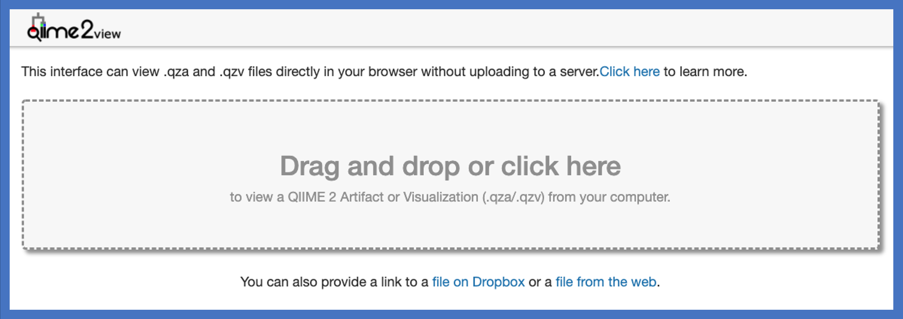

# Getting Started with iMAP

## Requirements (for reference)
List of required materials for running iMAP pipeline is available [here](https://www.microbiome-bioinfo.com/iMAP/Resources/imapmaterial.html).

The first step is to gather all the materials needed for implementing the iMAP pipeline. Most iMAP dependencies are executable and are already placed in the PATH using docker. Users should be able to launch analysis directly from the command line of the corresponding container. 

<br>

<!--
### Using specific platform

> Read [README2.md](https://github.com/tmbuza/iMAP/blob/master/README2.md) if you prefer to use a specific platform. README2 guides the implementation of iMAP directly on a specific platform, including Unix-Linux, Mac OS X, and Windows 10. Please note that this is work-in-progress.

<hr>
<br><
-->

<br>

### Download iMAP repository
```{}
git clone https://github.com/tmbuza/iMAP.git

# OR

curl -LOk https://github.com/tmbuza/iMAP/archive/master.zip
unzip master.zip
mv iMAP-master iMAP
rm -rf master.zip

# OR

wget --no-check-certificate https://github.com/tmbuza/iMAP/archive/master.zip 
unzip master.zip
mv iMAP-master iMAP
rm -rf master.zip

```

<br>

### Add data to designated folders 

>The following command copy the required data files located in the iMAP/resources/ and place them in their respective locations. It also download Silva seed database (default DB) and add it to the data/reference folder.
```{}
bash iMAP/code/00_allDemo_data.bash
```

<br>

### Download reference databases (for mothur-based pipeline only)
```{}
bash iMAP/code/refdatabase/iMAP_download_driver.bash
```
<br>

### Download reference database (QIIME2-based pipeline only)
```{}
bash iMAP/code/qiime2/qiime2-99-515-806-nb-classifier.bash
```
<br>

### Check missing folders or files
> Run checkFiles command everytime you want to verify any missing files. Add all missing files and check again untill everything looks ok.

```{}
bash iMAP/code/00_checkFiles_driver.bash 
```

<br>

### User's Options
Users who want to change the default settings may do so using any text editor. Use [this table](https://www.microbiome-bioinfo.com/iMAP/Resources/defaultsettings.html) to locate files with default parameters that may be altered. 
<br>
<hr>

### Install Docker Desktop
Link: [https://docs.docker.com/get-docker/](https://docs.docker.com/get-docker/).

### Set up Docker Account
* Docker ID grants you access to Docker Hub repositories. All you need is an email address.
* Register for a Docker ID at [https://docs.docker.com/docker-id/](https://docs.docker.com/docker-id/).

### Confirm the installation
* If the commands below work, then you are all set.
```{}
docker login
docker info
```

<br>
<hr>
<br>

## Metadata profiling
```{}
containerName=report1
docker run --rm --name=$containerName -it -v $(pwd)/iMAP:/imap --workdir=/imap  tmbuza/rpackages:v3.5.2 /bin/bash

bash code/01_metadataProfiling_driver.bash
exit
```

<br>

## Read Quality Control
```{}
containerName=readpreprocess
docker run --rm --name=$containerName -it -v $(pwd)/iMAP:/imap tmbuza/readqctools:v1.0.0 /bin/bash

bash code/02_readPreprocess_driver.bash

exit
```
> Make sure you exited the container which is done by running *exit* command above. That will bring you back to your normal CLI. The HTML QC-summary report (multiqc_report.html) is stored in the **iMAP/results/multiqc/ folder** and you can open them using your favorite browser or try to open it using CLI like:

```{}
open iMAP/results/multiqc/qced/R1/multiqc_report.html
```

<br>

### Read QC progress report
```{}
containerName=report2
docker run --rm --name=$containerName -it -v $(pwd)/iMAP:/imap --workdir=/imap  tmbuza/rpackages:v3.5.2 /bin/bash

bash code/progressreport2.bash
exit
```
<br>
<hr>

# Sequence Processing and Classification

<hr>
<br>

## A: MOTHUR-BASED PIPELINE
* Requires a Mothur-formatted classifer. 
* Default classifier is a recreated seed from [Silva database](https://mothur.org/wiki/silva_reference_files/).
* You can use different classifiers from [other Mothur taxonomy outlines](https://mothur.org/wiki/taxonomy_outline/).

### Download reference databases (Silva seed alignment & classifier)
```{}
bash iMAP/code/refdatabase/iMAP_download_driver.bash
```

### Check files
```{}
bash iMAP/code/00_checkFiles_driver.bash
```

### Download Mothur images
```{}
docker pull tmbuza/mothur:v1.41.3
```

### Create a container for bash CLI
```{}
containerName=mothurseqprocessing
docker run --rm --name=$containerName -it -v $(pwd)/iMAP:/imap --workdir=/imap tmbuza/mothur:v1.41.3 /bin/bash
```

### Start sequence processing and classification 
The sequence processing and classification command will implement the folllowing:

* Assemble the forward and reverse reads, screen by length and create representative sequences
* Align representative sequences with reference alignments..
* Denoise to remove poor alignments
* Remove Chimeric sequences.
* Classify the sequences and do post-classification QC.
* Estimates the sequencing error rate.

```{}
bash ./code/03_imapClassifySEQ_driver.bash 
```
> You may see a lot of WARNINGS. It is safe to ignore them. Also, the program is set to remove all temporary files after processing the sequences. If no any temporary file found you will see an error message that reads: *rm: cannot remove '*.temp': No such file or directory*. Just ignore it.

<br>

### Pick a method for OTU clustering and taxonomy assignement

**Method 1**: Phylotype-based method (works for large and small dataset).
    
```{}
bash ./code/04_1_phylotype_driver.bash
```
<br>

**Method 2**: OTU-cluster method (works best for small dataset).
    
```{}
bash ./code/04_2_otucluster_driver.bash
```

<br>

**Method 3**: Phylogeny-based method (works best for small dataset).
    
```{}
bash ./code/04_3_phylogeny_driver.bash
```

<hr>

*End of Mothur-based bioinformatics pipeline!*

<hr>
<br>
<br>

## B: QIIME2-BASED PIPELINE

* Must install iMAP repo first which will automatically create a directory named **iMAP**.
* Requires a QIIME2 trained classifer. Default: Greengenes 515-806 conservative fragments
* You can train your own classifier using the [q2-feature-classifier](https://github.com/qiime2/q2-feature-classifier).
* Classifier: Naive Bayes classifiers trained on GreenGenes or SILVA database with 99% OTUs. 

### Install iMAP repo (if not installed)
```{}
wget --no-check-certificate https://github.com/tmbuza/iMAP/archive/master.zip 
unzip master.zip
mv iMAP-master iMAP
rm -rf master.zip
```

### Load demo data
```{}
bash iMAP/code/demo_data.bash
```

### Download 515-806 conservative fragments
  * This is iMAP default classifier due to its small size.
  * Can be spanned by sequencing 200–300 nt from both ends using Illumina MiSeq.

  > Larger classifiers can cause memory issues which can ultimately kill a running instance.

```{}
bash iMAP/code/qiime2/qiime2-99-515-806-nb-classifier.bash
```
>If using other pretrained QIIME2-formatted classifiers you must replace the default settings in the executable file. Below is a location and the file to be altered. Find and replace "gg-13-8-99-515-806-nb-classifier.qza" string with the filename containing your favorable classifier.

<table>
<thead>
<tr>
<th align="left"><strong>Parameter to change</strong></th>
<th align="left"><strong>Filename</strong></th>
<th><strong>Default</strong></th>
</tr>
</thead>
<tbody>

<tr>
<td align="left">Classifier</td><td align="left">iMAP/code/qiime2/qiime2.bash</td><td>gg-13-8-99-515-806-nb-classifier.qza</td>
</tr>

</tr>
</tbody>
</table>

<br>

### Download QIIME2 images
> Credit goes to QIIME2 team for developing the qiime2core images. If you want you can pull the qiime2/core image directly from the [docker hub](https://hub.docker.com/layers/qiime2/core/2020.2/images/sha256-1e10d9831f08cbb65f4ad0018f83bf6ae180012afe2d05c86f727a99c7f91634?context=explore). Here we slightly modify the tag name to avoid messing up the original tag. Also note that, pulling a different image tag may require version-compartible trained OTU classifier.
```{}
docker pull tmbuza/qiime2core:v2020.2
# docker pull tmbuza/qiime2core:v2019.1
```


### Create QIIME2 container
```{}
containerName=qiime2classification
docker run --rm --name=$containerName -it -v $(pwd)/iMAP:/imap --workdir=/imap  tmbuza/qiime2core:v2019.1 /bin/bash
```

### Start the analysis
```{}
bash code/qiime2/qiime2.bash
```
### Exit the QIIME2 container
```{}
exit
```

### View QIIME 2 results
* Output path: iMAP/data/qiime2/results/
* Use client-side interface: [https://view.qiime2.org/](https://view.qiime2.org/) to view the results (see image below).
* Simply drag and drop the QIIME 2 artifacts (.qza files) or the visualizations (.qzv files). 
* For more help visit [https://view.qiime2.org/about](https://view.qiime2.org/about).

<br>



<hr>

*End of QIIME2-based bioinformatics pipeline!*

<hr>
<br>


<br>
<hr>

# Post-Classification Analysis
<h3><maroon>In Process</maroon></h3>

<hr>
<br>

## Related Links

| URLs | Description | Status |
|-------|--------------------| --------- |
|[Manuscript](https://rdcu.be/b5iVj) | In BMC Bioinformatics | Software |
|[README](https://github.com/tmbuza/iMAP/blob/master/README2.md/) | Guidelines | Quick user's guide ||
[Practical guide](https://www.microbiome-bioinfo.com/microbiomeanalysis/) | Systematic Microbiome data analysis  | eBook, coming in 2021 |
|[Useful link](https://www.microbiome-bioinfo.com/) | Consulting Services | In Progress |

<hr>
<br>


## Citation
Teresia M. Buza, Triza Tonui, Francesca Stomeo, Christian Tiambo, Robab Katani, Megan Schilling, Beatus Lyimo, Paul Gwakisa, Isabella M. Cattadori, Joram Buza and Vivek Kapur. iMAP: an integrated bioinformatics and visualization pipeline for microbiome data analysis. BMC Bioinformatics (2019) 20:374. [Free Full Text](https://rdcu.be/b5iVj).

<br>
<hr>

## Useful Links
<oL>
	<li></li>
	<li></li>
	<li></li>
	<li></li>
</ol>


